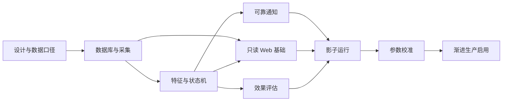

# Binance Market Radar V2：执行计划

> 本文保留早期 Phase 规划和技术交付策略。当前统一阶段、开发优先级和范围变更规则以
> [总体产品与开发 Roadmap](./v2-roadmap.md) 为准；冲突时先更新总体 Roadmap。

当前状态（2026-08-28）：Phase 0 已完成；Phase 1 已通过固定 7 天连续采集验收；Phase 2 已完成 15m/1h/4h/24h 收益率、数据质量门禁、Crypto/TradFi 分板块稳定 Top 5 和幂等榜单快照。MHR-9-1 的 Binance 合约状态感知、raw/session-adjusted 双覆盖率与历史质量查询已部署，jmk 正式 schema 为 7；当前正在完成 24 小时观察验收。观察期间已并行完成只读 R4-A0 七天候选指标分布分析，但持久化候选任务仍须等待 R3 验收通过。Phase 3 的定时报表、只读查询 API、PostgreSQL outbox 和有限重试已完成。MHR-8 独立 watchdog 已在 jmk live 运行，V2 reporter 仍禁用。

## 1. 交付策略

当前统一顺序为“数据可信 → 候选发现 → 证据确认 → 生命周期 → 结果评估 → 通知克制 → 页面研究”。
V1 在整个开发和影子运行期继续服务；V2 不通过一次大切换直接替换生产。

预计单人完成可用 V2 需要约 6 至 8 周。前 4 周目标是可影子运行的 MVP，后续 2 至 4 周用于 Web、评估、校准和生产硬化。估算不包含代理节点长时间不可用、Binance 接口政策变化或新增自动交易范围。

## 2. 分阶段计划

### Phase 0：设计冻结与开发基线

目标：让产品、数据口径和迁移边界无歧义。

- 在 `feature/v2-market-radar` 分支保存 V2 文档；
- 建立架构决策记录，固定全市场范围、两层采集、PostgreSQL、无自动交易和 7890 代理边界；
- 将冷启动阈值外置并定义规则版本格式；
- 定义 V1/V2 Compose project、端口、卷和环境文件命名。

完成标准：文档评审通过；没有尚未决定却会改变数据库主模型的问题。

### Phase 1：PostgreSQL 与市场数据底座

目标：获得可以长期验证的数据，而不是先写通知逻辑。

- 引入 pgx/v5 和版本化 SQL migration；
- 实现 instruments、15m K 线、5m 快照、采集任务和质量表；
- 扩展现有 Binance REST 客户端：K 线、OI、funding、mark price、taker 数据；
- 实现官方 WebSocket SDK 适配层、显式代理、watchdog、主动轮换和重连；
- 实现全市场内存窗口、批量落库、缺口检测和可恢复 backfill；
- 提供采集健康 CLI/API。

完成标准：连续 24 小时运行，无静默断流；完成 K 线与 Binance 对照一致；写入幂等；重启后可自动补缺。

### Phase 2：特征、候选和生命周期

目标：让每个信号可解释、可重放。

- 实现 15m/1h/4h/24h 收益、板块分位数、量能、OI、funding 和质量特征；
- 实现分板块候选门槛和最低流动性过滤；
- 实现版本化规则、综合分及证据列表；
- 实现单活动生命周期状态机和并发一致性；
- 保存 feature snapshot、signal lifecycle 和不可变 event；
- 加入离线 replay，使用同一数据重放指定规则版本。

完成标准：固定数据输入必然得到相同结果；每次状态变化可还原证据；坏数据不能产生 `CONFIRMED`。

### Phase 3：Telegram V2 与定时报表

目标：可靠发送有行动价值的信息，不制造重复和噪声。

- 实现数据库事务 outbox 和发送 worker；
- 实现状态变化消息、冷却、幂等、多 Chat ID 和发送审计；
- 重写六次定时报表，不包含跌幅 Top 5；
- 支持 dry-run、测试 Chat ID、正式 Chat ID 分阶段启用；
- 系统故障告警与市场信号使用不同模板和去重规则。

完成标准：故意制造 Telegram 超时和进程重启，消息最终送达且业务重复为 0；V1 不受影响。

### Phase 4：只读 Web 控制台

目标：Telegram 负责提醒，Web 负责研究和追溯。

- 实现 radar、instrument、signal、performance、health 只读 API；
- 实现机会雷达、标的详情、信号历史和系统健康页面；
- 前端资源嵌入 Go 二进制，不依赖运行时 CDN；
- 使用局域网/Tailscale 地址和基础认证，不开放公网；
- 对查询做分页、范围限制、超时和慢查询检查。

完成标准：Mac 能经 LAN/Tailscale 查看；常用查询达到目标延迟；未认证请求不可访问业务数据。

### Phase 5：效果评估和参数校准

目标：用结果决定规则，而不是凭感觉不断加条件。

- 实现 T+1h/T+4h/T+24h、MFE、MAE 评估任务；
- 实现按板块、规则版本、状态和市场阶段的样本分析；
- 回补可获得的 Binance 历史 K 线并标记数据覆盖范围；
- 影子运行至少 7 天，统计候选数、通知数、完整率、误报形态；
- 发布新的规则版本，不修改旧事件的历史解释。

完成标准：每个到期信号都有评估；页面明确显示样本数；阈值调整有数据依据和版本记录。

### Phase 6：生产硬化与渐进切换

目标：V2 故障可发现、可恢复、可回退。

- 完成 jmk 独立 Compose、资源限制、健康检查和日志轮转；
- 验证 V2 Binance/Telegram 只走 7890，7891 完全不变；
- 配置每日备份并实际恢复到临时库；
- 演练 WS 断线、代理失效、429、Telegram 超时、数据库重启；
- 先启用测试群，再启用正式事件通知；
- 单独决策何时停 V1，保留旧镜像和状态卷作为回退。

完成标准：7 天影子运行达到数据完整率与重复通知指标；恢复演练成功；生产启用后仍能一条命令停 V2、继续 V1。

## 3. 首个四周迭代建议

| 周次 | 主交付物 | 验证重点 |
| --- | --- | --- |
| 第 1 周 | migration、核心 schema、目录同步、REST 扩展 | 数据类型、幂等、限流 |
| 第 2 周 | WS 适配、窗口缓存、5m 快照、15m K 线与缺口回补 | 断流恢复、完整率、代理 |
| 第 3 周 | 特征、候选、规则版本、生命周期和 replay | 可解释、可复现、坏数据降级 |
| 第 4 周 | outbox、V2 Telegram dry-run、定时摘要、shadow 部署 | 去重、冷却、V1 隔离 |

完成第 4 周后，系统应能在 jmk 上“只记录不正式通知”地稳定运行。此时先收数据，再建设更完整的 Web 和效果页，比继续堆叠未经验证的信号规则更有价值。

## 4. 开发顺序与依赖

采集和数据库是所有后续工作的硬依赖。Telegram 模板不是第一优先级：如果历史数据和状态机不可信，消息排版再好也只会更快地传播错误判断。

## 5. 每阶段通用质量门禁

每个阶段合并前必须满足：

- `go test ./...` 与 `go vet ./...` 通过；
- 新增核心逻辑有单元测试，数据库行为有集成测试；
- 配置、日志和测试样本不包含真实 Token、Chat ID 或数据库密码；
- migration 有向前执行测试，并明确回退/兼容策略；
- 文档与实际环境变量、端口和命令同步；
- 对 V1 的行为变化必须为零，除非在单独变更中明确批准。

## 6. 近期开发任务队列

开始编码后的前十项任务建议按以下顺序执行：

1. 增加 V2 配置结构和 `worker/api/migrate/backfill` 命令骨架；
2. 建立 PostgreSQL migration 和本地测试 Compose；
3. 实现 instrument 有效期模型与每小时目录同步；
4. 封装官方 WebSocket market adapter；
5. 实现最新价缓存、分钟环形窗口和 5 分钟批量快照；
6. 实现 15 分钟 K 线采集、历史回补和缺口检查；
7. 实现候选深度 REST 采集器及端点级限速；
8. 实现特征快照、板块分位数和数据质量门禁；
9. 实现规则版本与生命周期状态机；
10. 实现事务 outbox、Telegram dry-run 和 V2 定时摘要。

## 7. 需要用户在实施前确认的产品参数

这些选择不阻塞架构设计，但应在对应阶段开始前确认：

- Web 控制台最终使用的 jmk 端口和访问域名；
- V2 测试 Chat ID 与正式 Chat ID 是否分开；
- TradFi 的最低流动性口径和非交易时段处理；
- 每日可接受的事件通知数量上限；
- 备份目录所在磁盘及期望保留周期；
- V1 定时报表最终是保留、由 V2 接管，还是在稳定期后停止。
