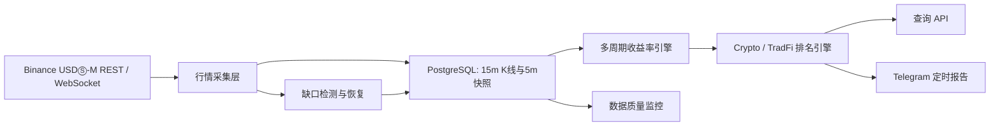

# V2 多周期涨幅 Top 5：需求与执行台账

> 本文档是“15 分钟、1 小时、4 小时、24 小时涨幅 Top 5”功能的唯一执行台账。需求变更、阶段状态、验收结果和遗留风险均在此更新；阶段未通过验收前不得标记为完成。

## 1. 文档信息

| 项目 | 内容 |
| --- | --- |
| 状态 | ACTIVE |
| 当前阶段 | MHR-3：历史回补与缺口恢复 |
| 所属版本 | V2 Market Radar |
| 开发分支 | `feature/v2-market-radar` |
| 创建日期 | 2026-08-09 |
| 最后更新 | 2026-08-09 |

## 2. 背景与目标

V1 使用 Binance USDⓈ-M 永续合约滚动 24 小时涨跌幅生成定时通知，只能说明“过去 24 小时已经涨了多少”，无法区分启动、加速、延续和冲高回落。V2 需要建立自己的连续行情序列，计算多个观察周期，并在 Crypto 与 TradFi 两个板块中分别排名。

本功能的目标是：

1. 覆盖 Binance USDⓈ-M 永续合约的有效监控标的。
2. 在后台持续计算 `15m`、`1h`、`4h`、`24h` 滚动涨幅。
3. Crypto 与 TradFi 分板块计算各周期涨幅 Top 5。
4. 后台计算与 Telegram 通知解耦：后台默认每 5 分钟更新，Telegram 仍按配置的固定时点推送。
5. Telegram 暂时只推送涨幅 Top 5，不推送跌幅 Top 5。
6. 对数据缺口、行情陈旧、新上市历史不足等情况明确标注或排除，绝不使用伪造价格补齐。

## 3. 非目标

本阶段明确不包含：

- 自动交易、自动下单或仓位管理。
- 用 24 小时 ticker 的涨跌幅近似 15 分钟、1 小时或 4 小时涨幅。
- 修改 V1 的生产通知逻辑；V2 在验证通过前独立演进。
- 将每次后台计算都推送到 Telegram。
- 对缺失行情进行线性插值后参与排名。
- 本阶段直接实现技术指标、新闻情绪、资金费率策略或投资建议评分；这些属于后续扩展。

## 4. 指标定义

### 4.1 滚动收益率

对周期 `h`，收益率定义为：

```text
return_h = (P(as_of) / P(as_of - h) - 1) × 100%
```

- `as_of`：按北京时间展示、内部以 UTC 存储，并对齐到最近一个已完成的 5 分钟边界。
- `P(as_of)`：不晚于 `as_of` 的最新有效价格。
- `P(as_of - h)`：不晚于目标时点的最近有效历史价格。
- 基准价格距离目标时点超过允许误差时，该周期结果记为不可用，不参与排名。

### 4.2 初始周期与容差

| 周期 | 默认历史来源 | 最大基准偏差 | 说明 |
| --- | --- | --- | --- |
| 15m | 15m 已完成 K 线 / 5m 快照 | 5 分钟 | 优先使用已完成 K 线的收盘价 |
| 1h | 15m 已完成 K 线 / 5m 快照 | 5 分钟 | 需要至少 1 小时有效历史 |
| 4h | 15m 已完成 K 线 / 5m 快照 | 5 分钟 | 需要至少 4 小时有效历史 |
| 24h | 15m 已完成 K 线 / 5m 快照 | 5 分钟 | V2 自计算，不依赖 ticker 的 `priceChangePercent` |

容差最终以配置项实现；上表是第一版默认值。

### 4.3 排名口径

- Crypto 与 TradFi 分开排名，不混排。
- 每个板块、每个周期独立生成 Top 5。
- 只纳入状态有效、价格为正、历史完整且数据未过期的标的。
- 收益率相同时，按成交额降序；仍相同时按 symbol 字典序，确保结果稳定可复现。
- 少于 5 个合格标的时输出实际数量，并携带数据覆盖说明。

## 5. 产品行为

### 5.1 后台计算

- 默认每 5 分钟执行一次特征计算与板块排名。
- 计算结果写入存储，供 API、后台页面和 Telegram 读取。
- 同一 `as_of + sector + horizon + symbol` 重复计算必须幂等。

### 5.2 Telegram 通知

- 沿用可配置的定时推送时点，默认北京时间 `00:00、04:00、08:00、12:00、16:00、20:00、24:00`。
- 暂时只展示 Crypto 与 TradFi 的涨幅 Top 5。
- 每个标的至少展示：名称、symbol、15m、1h、4h、24h 涨幅、最新价、24h 成交额和一句标的介绍。
- 缺少某一周期时显示 `N/A`，但若该标的不满足目标排名周期的数据质量要求，则不得进入该周期榜单。
- 通知必须包含数据时间、时区、数据覆盖率和风险提示，不把排名描述为买入建议。

### 5.3 API 预期

API 至少支持：

- 查询指定板块与周期的最新 Top N。
- 查询指定 symbol 的多周期收益率与数据质量。
- 查询采集延迟、缺口数量和有效标的覆盖率。

## 6. 数据质量规则

以下任一情况发生时，相应周期不得参与排名：

1. 当前价格缺失、非正数或超过新鲜度阈值。
2. 基准历史价格缺失或距离目标时点超过容差。
3. 时间窗口内存在未恢复的关键缺口。
4. 新上市合约的有效历史长度不足。
5. 合约已经下架、暂停交易或不再属于监控 universe。

每条计算结果应携带至少以下质量字段：

- `is_valid`
- `current_price_at`
- `baseline_price_at`
- `current_age_seconds`
- `baseline_offset_seconds`
- `gap_count`
- `invalid_reason`

TradFi 合约还应保留交易时段和流动性状态；闭市或流动性异常时不得把陈旧价格造成的排名变化解释为实时行情。

## 7. 技术方案

### 7.1 数据流



### 7.2 模块边界

| 模块 | 职责 |
| --- | --- |
| `internal/binance` | Binance K 线 REST 请求、响应解析、错误归一化 |
| `internal/domain/market` | K 线、价格点、周期、收益率与质量模型 |
| `internal/collector` | 实时采集、限速、重试、分页回补与幂等编排 |
| `internal/storage/postgres` | K 线、快照、特征和排名持久化 |
| `internal/feature` | 15m/1h/4h/24h 收益率计算与质量门禁 |
| `internal/ranking` | 分板块稳定排序与 Top N 生成 |
| `internal/api` | 查询收益率、排名和采集健康状态 |
| `internal/report` / `internal/telegram` | 消费已计算结果并生成通知，不现场抓取和临时计算 |

### 7.3 外部接口与依赖原则

- K 线数据使用 Binance USDⓈ-M Futures REST `GET /fapi/v1/klines`。
- 实时价格继续复用现有 Binance 官方 Go WebSocket SDK 接入。
- REST 限速计划使用成熟的 `golang.org/x/time/rate`，不自行实现令牌桶。
- 金额和价格继续使用精确十进制类型，不用 `float64` 作为领域存储值。
- PostgreSQL 是行情和计算结果的事实来源；Redis 可在查询压力明确后作为缓存引入，不是本功能前置条件。

## 8. 已有基础

截至 2026-08-09，V2 已具备：

- Cobra CLI 与模块化命令结构。
- PostgreSQL 连接、迁移和 `klines_15m` 表。
- Binance universe 同步。
- Binance 官方 WebSocket SDK 实时行情接入。
- WebSocket 看门狗、latest store、两小时分钟窗口与 5 分钟快照。
- PostgreSQL 批量写入、数据缺口标记、重启预热。
- 真实 PostgreSQL 集成测试与 jmk 代理链路冒烟验证。

当前两小时内存窗口不足以直接计算 4 小时和 24 小时收益率，因此必须以 PostgreSQL 历史数据和 K 线回补作为主路径；后续可将热窗口扩展为至少 6 小时，用于低延迟计算 15m/1h/4h。

## 9. 主要阻碍与处理策略

| 阻碍 | 影响 | 处理策略 |
| --- | --- | --- |
| V2 尚未积累稳定生产历史 | 无法立刻验证 24h 排名 | REST 回补历史 + 24 至 72 小时影子运行 |
| 全市场 K 线请求受权重限制 | 回补过快会触发限流 | 全局限速、按 symbol 分页、指数退避、断点续传 |
| 合约数量多，历史数据量大 | 影响 PG 容量和索引 | 分批回补；先满足 24h，再扩展长期历史；评估分区和保留策略 |
| 新上市、停牌、闭市与断流 | 产生虚假高排名 | 严格数据质量门禁、缺口审计和状态标签 |
| 代理节点不稳定 | Binance/Telegram 请求失败 | 独立健康检查、明确超时、有限重试、失败告警，不静默吞错 |
| 多周期榜单可能让 Telegram 过长 | 降低可读性 | 先采用“每个板块一个 Top 5，行内展示四周期”，再依据实际消息长度调整 |

## 10. 分阶段执行计划

状态仅允许：`PENDING`、`IN_PROGRESS`、`BLOCKED`、`COMPLETED`。

| ID | 阶段 | 状态 | 完成标准 | 预计工作量 |
| --- | --- | --- | --- | --- |
| MHR-0 | 需求基线与活文档 | COMPLETED | 新文档建立、进入 docs 索引、范围和口径明确 | 0.5 天 |
| MHR-1 | 15m K 线领域模型与 Binance REST 客户端 | COMPLETED | 参数校验、响应解析、错误处理和单元测试全部通过 | 0.5–1 天 |
| MHR-2 | 限速采集与 PostgreSQL 幂等写入 | COMPLETED | 全局限速、重试、批写、重复写安全；集成测试通过 | 1–1.5 天 |
| MHR-3 | 历史回补与缺口恢复 | IN_PROGRESS | 可回补至少 30 小时；支持断点续跑；缺口审计可查询 | 1–1.5 天 |
| MHR-4 | 多周期收益率与质量门禁 | PENDING | 15m/1h/4h/24h 计算正确；缺失/陈旧数据被排除 | 1–1.5 天 |
| MHR-5 | 分板块稳定排名 | PENDING | Crypto/TradFi 各周期 Top N 正确且结果可复现 | 0.5–1 天 |
| MHR-6 | API 与 Telegram 报告 | PENDING | API 可查询；消息格式、长度、失败处理测试通过 | 1–1.5 天 |
| MHR-7 | 影子运行、部署与验收 | PENDING | jmk 连续运行 24–72 小时；延迟、覆盖率、缺口达标 | 1–3 天观察期 |

整体开发预计约 7–10 个开发日，另加 24–72 小时影子运行。实际进度以验收证据为准，不以估时为准。

## 11. MHR-1 验收结果

- [x] 定义 K 线 interval、请求参数和领域模型，价格与成交量使用精确十进制。
- [x] 支持 `/fapi/v1/klines` 的 `symbol`、`interval`、`startTime`、`endTime`、`limit` 参数。
- [x] 校验 symbol、interval、时间范围和 limit，非法参数不发网络请求。
- [x] 正确解析 Binance 数组格式响应，包括开高低收、成交量、成交额、成交笔数和主动买入量。
- [x] 将 Binance 非 2xx 响应转换为包含状态码和响应摘要的明确错误。
- [x] 使用 `httptest` 覆盖成功、参数、畸形响应和服务端错误。
- [x] `go test ./...` 通过。
- [x] `go vet ./...` 通过。

验收证据：

- 领域模型：`internal/domain/market/kline.go`。
- Binance 适配器：`internal/binance/klines.go`。
- 测试：`internal/domain/market/kline_test.go`、`internal/binance/klines_test.go`。
- `go test ./...`：通过，覆盖 V1、V2 全部现有包。
- `go vet ./...`：通过。
- `go test -race ./internal/domain/market ./internal/binance`：通过。
- `git diff --check`、`gofmt -d` 和尾随空格检查：通过。

关键决定：

- 第一阶段只开放 `15m` interval，与事实表 `klines_15m` 保持一致；其他周期收益率由 15m K 线和 5m 快照计算，不把 1h/4h K 线混入该表。
- Binance 返回的价格和成交量字符串直接解析为 `decimal.Decimal`，不经过 `float64`。
- 保留 Binance 的毫秒级闭盘时间语义，严格验证 `open_time + 15m - 1ms`。
- REST 适配器返回所有合法 K 线；是否已完成由 `Kline.IsClosed` 与 MHR-2 采集器负责，避免在底层客户端隐式丢数据。

## 12. MHR-2 验收结果

- [x] 定义 K 线 source/repository 接口，采集器不依赖 Binance 或 pgx 具体类型。
- [x] 使用全进程共享限速器，不能为每个 symbol 创建独立限速器规避权重限制。
- [x] 根据 K 线请求 limit 计算请求权重并等待令牌。
- [x] 仅持久化已完成的 15m K 线；未完成 K 线不得进入事实表。
- [x] PostgreSQL 使用批量事务和 `(instrument_id, open_time)` 幂等写入。
- [x] 网络超时、429、418 和 5xx 使用有上限的分类重试；永久参数错误不重试。
- [x] 单元测试覆盖限速、过滤、取消、错误和幂等编排。
- [x] PostgreSQL 集成测试验证重复采集不会产生重复行。
- [x] `go test ./...`、`go vet ./...` 和新增模块 race 测试通过。

验收证据：

- 领域查询和批次契约：`internal/domain/market/kline.go`。
- Binance limit 权重映射与共享 limiter 接入：`internal/binance/klines.go`、
  `internal/binance/client.go`、`internal/ratelimit/weight.go`。
- 完成 K 线过滤与依赖反转采集编排：`internal/collector/kline.go`。
- PostgreSQL 批事务和 upsert：`internal/storage/postgres/kline_repository.go`。
- 分类重试及 `Retry-After`：`internal/httpjson/client.go`。
- V2 默认使用每分钟 1800 权重、burst 50；配置入口为
  `BINANCE_REQUEST_WEIGHT_PER_MINUTE` 与 `BINANCE_REQUEST_WEIGHT_BURST`。
- `POSTGRES_TEST_URL=<隔离测试库> go test -count=1 ./...`：通过；真实执行 universe、
  snapshot 和 K 线 PostgreSQL 集成测试，重复写入后 `klines_15m` 仍为 2 行，修正值被更新。
- `go vet ./...`：通过。
- `go test -race -count=1 ./...`：通过。
- `git diff --check`：通过。

关键决定：

- MHR-2 提供“单 symbol、单页”的可复用采集原语；全市场分页、并发预算、断点和缺口恢复由
  MHR-3 编排，避免将调度策略写死在 Binance 适配器中。
- `limit=0` 按 Binance 默认 500 条计算权重 5；显式 limit 按官方阶梯计算 1/2/5/10。
- 418、429 和 5xx 才进行状态码重试；400 等永久请求错误立即返回。网络错误有限重试，
  所有退避都响应 context 取消，服务端 `Retry-After` 最多等待 30 秒。
- repository 在事务开始前再次拒绝未完成或重复 K 线；合约映射缺失时整批失败，不允许部分落库。
- 初次历史回补使用当前 active instrument 记录。`valid_from` 是本系统首次观察时间，不是交易所
  上市时间，因此不能据此错误拒绝更早的合法历史 K 线。

## 13. 后续阶段验收摘要

### MHR-3

- 默认先回补至少 30 小时，为 24h 计算保留安全余量。
- 支持从已有最大 open time 继续，不重复扫描全部历史。
- 可列出每个 symbol 的缺口区间、恢复状态和最后错误。

### MHR-4

- 表驱动测试覆盖上涨、下跌、零变化、边界时间、缺口、陈旧数据和新上市。
- 结果包含实际基准时点和偏差，不只返回一个百分比。
- 15m/1h/4h 热计算窗口至少覆盖 6 小时；24h 从 PostgreSQL 读取。

### MHR-5

- Crypto 与 TradFi 独立排序。
- 同收益率排序稳定；不足 5 个标的时行为明确。
- 无效数据不会因为默认零值进入榜单。

### MHR-6

- API 返回 `as_of`、周期、板块、排名、质量和覆盖率。
- Telegram 只推送涨幅 Top 5，并能在 Telegram 消息长度限制内安全拆分。
- Telegram 发送失败可观测、可重试且不会无限重复发送。

### MHR-7

- jmk 生产配置不覆盖 V1，先以独立服务或关闭通知的影子模式运行。
- 连续观察期间无持续缺口，计算延迟和有效 universe 覆盖率达到配置阈值。
- 人工抽样与 Binance K 线原始值复核至少 10 个 symbol × 4 个周期。

## 14. 文档更新规则

每完成一个阶段，必须在同一个代码变更中更新本文档：

1. 将阶段状态改为 `COMPLETED`，并把下一阶段改为 `IN_PROGRESS`。
2. 更新“文档信息”中的当前阶段和最后更新日期。
3. 在“执行记录”中记录代码路径、测试命令、测试结果和关键设计决定。
4. 在对应验收清单中逐项勾选；没有证据的项目不得勾选。
5. 新发现的风险必须进入“主要阻碍与处理策略”，不能只留在聊天记录中。
6. 需求发生变化时先更新本文档，再修改代码。

## 15. 执行记录

### 2026-08-09 — MHR-0 完成，MHR-1 开始

- 建立本文档，固定多周期指标、排名口径、数据质量规则与阶段验收标准。
- 决定后台默认每 5 分钟计算，Telegram 继续按固定时点推送。
- 决定 Telegram 暂时只推送涨幅 Top 5，不推送跌幅榜。
- 当前开始实现 15 分钟 K 线领域模型与 Binance REST 客户端。

### 2026-08-09 — MHR-1 完成，MHR-2 开始

- 新增 `market.Kline`、`KlineInterval15m`、完整领域校验与闭盘判断。
- 新增 Binance `KlineRequest` 与 `FetchKlines`，支持公开 K 线接口的完整查询参数。
- 适配器严格解析数组响应，使用精确十进制，并保留可通过 `errors.As` 判断的 HTTP 状态错误。
- 定向测试、全仓库测试、vet、race、格式和 diff 检查全部通过。
- 未调用生产 Binance、未连接 jmk、未修改 V1 运行状态；MHR-1 验收不依赖外部环境。
- 下一步实现共享权重限速、已完成 K 线过滤与 PostgreSQL 幂等批写。

### 2026-08-09 — MHR-2 完成，MHR-3 开始

- 将 K 线查询和写入契约固定在领域层；Binance 和 PostgreSQL 只作为接口适配器。
- 引入 `golang.org/x/time/rate` 进程级共享权重 limiter，并按 K 线 limit 计算实际请求权重。
- 采集器仅持久化 `close_time <= now` 的完成 K 线，拒绝来源错标的、重复和畸形数据。
- PostgreSQL 使用 pgx Batch 事务和 `(instrument_id, open_time)` upsert，重复回放更新但不增行。
- HTTP 客户端完成网络错误、418、429、5xx 分类重试，支持 `Retry-After` 和 context 取消。
- 使用独立临时 PostgreSQL 17 容器完成真实集成验收；测试后容器已停止并自动删除。
- 全仓库普通测试、vet、全仓库 race 和 diff 检查全部通过；未连接 jmk，未修改 V1。
- 下一步实现至少 30 小时历史回补、按最大已存 open time 断点续跑和缺口审计。
