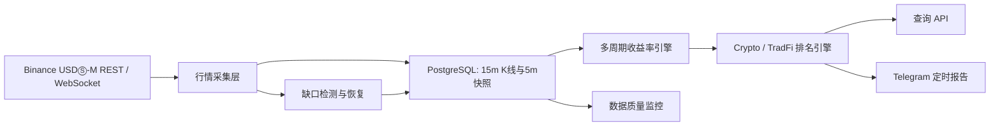

# V2 多周期涨幅 Top 5：需求与执行台账

> 本文档是“15 分钟、1 小时、4 小时、24 小时涨幅 Top 5”功能的唯一执行台账。需求变更、阶段状态、验收结果和遗留风险均在此更新；阶段未通过验收前不得标记为完成。

## 1. 文档信息

| 项目 | 内容 |
| --- | --- |
| 状态 | ACTIVE |
| 当前阶段 | MHR-6：API 与 Telegram 报告 |
| 所属版本 | V2 Market Radar |
| 开发分支 | `feature/v2-market-radar` |
| 创建日期 | 2026-08-09 |
| 最后更新 | 2026-08-09 |

## 2. 背景与目标

V1 使用 Binance USDⓈ-M 永续合约滚动 24 小时涨跌幅生成定时通知，只能说明“过去 24 小时已经涨了多少”，无法区分启动、加速、延续和冲高回落。V2 需要建立自己的连续行情序列，计算多个观察周期，并在 Crypto 与 TradFi 两个板块中分别排名。

本功能的目标是：

1. 覆盖 Binance USDⓈ-M 永续合约的有效监控标的。
2. 在后台持续计算 `15m`、`1h`、`4h`、`24h` 滚动涨幅。
3. Crypto 与 TradFi 分板块计算各周期涨幅 Top 5。
4. 后台计算与 Telegram 通知解耦：后台默认每 5 分钟更新，Telegram 仍按配置的固定时点推送。
5. Telegram 暂时只推送涨幅 Top 5，不推送跌幅 Top 5。
6. 对数据缺口、行情陈旧、新上市历史不足等情况明确标注或排除，绝不使用伪造价格补齐。

## 3. 非目标

本阶段明确不包含：

- 自动交易、自动下单或仓位管理。
- 用 24 小时 ticker 的涨跌幅近似 15 分钟、1 小时或 4 小时涨幅。
- 修改 V1 的生产通知逻辑；V2 在验证通过前独立演进。
- 将每次后台计算都推送到 Telegram。
- 对缺失行情进行线性插值后参与排名。
- 本阶段直接实现技术指标、新闻情绪、资金费率策略或投资建议评分；这些属于后续扩展。

## 4. 指标定义

### 4.1 滚动收益率

对周期 `h`，收益率定义为：

```text
return_h = (P(as_of) / P(as_of - h) - 1) × 100%
```

- `as_of`：按北京时间展示、内部以 UTC 存储，并对齐到最近一个已完成的 5 分钟边界。
- `P(as_of)`：不晚于 `as_of` 的最新有效价格。
- `P(as_of - h)`：不晚于目标时点的最近有效历史价格。
- 基准价格距离目标时点超过允许误差时，该周期结果记为不可用，不参与排名。

### 4.2 初始周期与容差

| 周期 | 默认历史来源 | 最大基准偏差 | 说明 |
| --- | --- | --- | --- |
| 15m | 15m 已完成 K 线 / 5m 快照 | 5 分钟 | 优先使用已完成 K 线的收盘价 |
| 1h | 15m 已完成 K 线 / 5m 快照 | 5 分钟 | 需要至少 1 小时有效历史 |
| 4h | 15m 已完成 K 线 / 5m 快照 | 5 分钟 | 需要至少 4 小时有效历史 |
| 24h | 15m 已完成 K 线 / 5m 快照 | 5 分钟 | V2 自计算，不依赖 ticker 的 `priceChangePercent` |

容差最终以配置项实现；上表是第一版默认值。

### 4.3 排名口径

- Crypto 与 TradFi 分开排名，不混排。
- 每个板块、每个周期独立生成 Top 5。
- 只纳入状态有效、价格为正、历史完整且数据未过期的标的。
- 收益率相同时，按成交额降序；仍相同时按 symbol 字典序，确保结果稳定可复现。
- 少于 5 个合格标的时输出实际数量，并携带数据覆盖说明。

## 5. 产品行为

### 5.1 后台计算

- 默认每 5 分钟执行一次特征计算与板块排名。
- 计算结果写入存储，供 API、后台页面和 Telegram 读取。
- 同一 `as_of + sector + horizon + symbol` 重复计算必须幂等。

### 5.2 Telegram 通知

- 沿用可配置的定时推送时点，默认北京时间 `00:00、04:00、08:00、12:00、16:00、20:00、24:00`。
- 暂时只展示 Crypto 与 TradFi 的涨幅 Top 5。
- 每个标的至少展示：名称、symbol、15m、1h、4h、24h 涨幅、最新价、24h 成交额和一句标的介绍。
- 缺少某一周期时显示 `N/A`，但若该标的不满足目标排名周期的数据质量要求，则不得进入该周期榜单。
- 通知必须包含数据时间、时区、数据覆盖率和风险提示，不把排名描述为买入建议。

### 5.3 API 预期

API 至少支持：

- 查询指定板块与周期的最新 Top N。
- 查询指定 symbol 的多周期收益率与数据质量。
- 查询采集延迟、缺口数量和有效标的覆盖率。

## 6. 数据质量规则

以下任一情况发生时，相应周期不得参与排名：

1. 当前价格缺失、非正数或超过新鲜度阈值。
2. 基准历史价格缺失或距离目标时点超过容差。
3. 时间窗口内存在未恢复的关键缺口。
4. 新上市合约的有效历史长度不足。
5. 合约已经下架、暂停交易或不再属于监控 universe。

每条计算结果应携带至少以下质量字段：

- `is_valid`
- `current_price_at`
- `baseline_price_at`
- `current_age_seconds`
- `baseline_offset_seconds`
- `gap_count`
- `invalid_reason`

TradFi 合约还应保留交易时段和流动性状态；闭市或流动性异常时不得把陈旧价格造成的排名变化解释为实时行情。

## 7. 技术方案

### 7.1 数据流



### 7.2 模块边界

| 模块 | 职责 |
| --- | --- |
| `internal/binance` | Binance K 线 REST 请求、响应解析、错误归一化 |
| `internal/domain/market` | K 线、价格点、周期、收益率与质量模型 |
| `internal/collector` | 实时采集、限速、重试、分页回补与幂等编排 |
| `internal/storage/postgres` | K 线、快照、特征和排名持久化 |
| `internal/feature` | 15m/1h/4h/24h 收益率计算与质量门禁 |
| `internal/ranking` | 分板块稳定排序与 Top N 生成 |
| `internal/api` | 查询收益率、排名和采集健康状态 |
| `internal/report` / `internal/telegram` | 消费已计算结果并生成通知，不现场抓取和临时计算 |

### 7.3 外部接口与依赖原则

- K 线数据使用 Binance USDⓈ-M Futures REST `GET /fapi/v1/klines`。
- 实时价格继续复用现有 Binance 官方 Go WebSocket SDK 接入。
- REST 限速计划使用成熟的 `golang.org/x/time/rate`，不自行实现令牌桶。
- 金额和价格继续使用精确十进制类型，不用 `float64` 作为领域存储值。
- PostgreSQL 是行情和计算结果的事实来源；Redis 可在查询压力明确后作为缓存引入，不是本功能前置条件。

## 8. 已有基础

截至 2026-08-09，V2 已具备：

- Cobra CLI 与模块化命令结构。
- PostgreSQL 连接、迁移和 `klines_15m` 表。
- Binance universe 同步。
- Binance 官方 WebSocket SDK 实时行情接入。
- WebSocket 看门狗、latest store、六小时分钟窗口与 5 分钟快照。
- PostgreSQL 批量写入、数据缺口标记、重启预热。
- 真实 PostgreSQL 集成测试与 jmk 代理链路冒烟验证。

当前热窗口已扩展至至少 6 小时，用于低延迟的 15m/1h/4h 价格历史；可复现计算仍统一读取
PostgreSQL 的 5 分钟快照和已完成 15 分钟 K 线，24h 始终以 PostgreSQL 历史为事实来源。

## 9. 主要阻碍与处理策略

| 阻碍 | 影响 | 处理策略 |
| --- | --- | --- |
| V2 尚未积累稳定生产历史 | 无法立刻验证 24h 排名 | REST 回补历史 + 24 至 72 小时影子运行 |
| 全市场 K 线请求受权重限制 | 回补过快会触发限流 | 全局限速、按 symbol 分页、指数退避、断点续传 |
| 合约数量多，历史数据量大 | 影响 PG 容量和索引 | 分批回补；先满足 24h，再扩展长期历史；评估分区和保留策略 |
| 新上市、停牌、闭市与断流 | 产生虚假高排名 | 严格数据质量门禁、缺口审计和状态标签 |
| 代理节点不稳定 | Binance/Telegram 请求失败 | 独立健康检查、明确超时、有限重试、失败告警，不静默吞错 |
| 多周期榜单可能让 Telegram 过长 | 降低可读性 | 先采用“每个板块一个 Top 5，行内展示四周期”，再依据实际消息长度调整 |

## 10. 分阶段执行计划

状态仅允许：`PENDING`、`IN_PROGRESS`、`BLOCKED`、`COMPLETED`。

| ID | 阶段 | 状态 | 完成标准 | 预计工作量 |
| --- | --- | --- | --- | --- |
| MHR-0 | 需求基线与活文档 | COMPLETED | 新文档建立、进入 docs 索引、范围和口径明确 | 0.5 天 |
| MHR-1 | 15m K 线领域模型与 Binance REST 客户端 | COMPLETED | 参数校验、响应解析、错误处理和单元测试全部通过 | 0.5–1 天 |
| MHR-2 | 限速采集与 PostgreSQL 幂等写入 | COMPLETED | 全局限速、重试、批写、重复写安全；集成测试通过 | 1–1.5 天 |
| MHR-3 | 历史回补与缺口恢复 | COMPLETED | 可回补至少 30 小时；支持断点续跑；缺口审计可查询 | 1–1.5 天 |
| MHR-4 | 多周期收益率与质量门禁 | COMPLETED | 15m/1h/4h/24h 计算正确；缺失/陈旧数据被排除 | 1–1.5 天 |
| MHR-5 | 分板块稳定排名 | COMPLETED | Crypto/TradFi 各周期 Top N 正确且结果可复现 | 0.5–1 天 |
| MHR-6 | API 与 Telegram 报告 | IN_PROGRESS | API 可查询；消息格式、长度、失败处理测试通过 | 1–1.5 天 |
| MHR-7 | 影子运行、部署与验收 | PENDING | jmk 连续运行 24–72 小时；延迟、覆盖率、缺口达标 | 1–3 天观察期 |

整体开发预计约 7–10 个开发日，另加 24–72 小时影子运行。实际进度以验收证据为准，不以估时为准。

## 11. MHR-1 验收结果

- [x] 定义 K 线 interval、请求参数和领域模型，价格与成交量使用精确十进制。
- [x] 支持 `/fapi/v1/klines` 的 `symbol`、`interval`、`startTime`、`endTime`、`limit` 参数。
- [x] 校验 symbol、interval、时间范围和 limit，非法参数不发网络请求。
- [x] 正确解析 Binance 数组格式响应，包括开高低收、成交量、成交额、成交笔数和主动买入量。
- [x] 将 Binance 非 2xx 响应转换为包含状态码和响应摘要的明确错误。
- [x] 使用 `httptest` 覆盖成功、参数、畸形响应和服务端错误。
- [x] `go test ./...` 通过。
- [x] `go vet ./...` 通过。

验收证据：

- 领域模型：`internal/domain/market/kline.go`。
- Binance 适配器：`internal/binance/klines.go`。
- 测试：`internal/domain/market/kline_test.go`、`internal/binance/klines_test.go`。
- `go test ./...`：通过，覆盖 V1、V2 全部现有包。
- `go vet ./...`：通过。
- `go test -race ./internal/domain/market ./internal/binance`：通过。
- `git diff --check`、`gofmt -d` 和尾随空格检查：通过。

关键决定：

- 第一阶段只开放 `15m` interval，与事实表 `klines_15m` 保持一致；其他周期收益率由 15m K 线和 5m 快照计算，不把 1h/4h K 线混入该表。
- Binance 返回的价格和成交量字符串直接解析为 `decimal.Decimal`，不经过 `float64`。
- 保留 Binance 的毫秒级闭盘时间语义，严格验证 `open_time + 15m - 1ms`。
- REST 适配器返回所有合法 K 线；是否已完成由 `Kline.IsClosed` 与 MHR-2 采集器负责，避免在底层客户端隐式丢数据。

## 12. MHR-2 验收结果

- [x] 定义 K 线 source/repository 接口，采集器不依赖 Binance 或 pgx 具体类型。
- [x] 使用全进程共享限速器，不能为每个 symbol 创建独立限速器规避权重限制。
- [x] 根据 K 线请求 limit 计算请求权重并等待令牌。
- [x] 仅持久化已完成的 15m K 线；未完成 K 线不得进入事实表。
- [x] PostgreSQL 使用批量事务和 `(instrument_id, open_time)` 幂等写入。
- [x] 网络超时、429、418 和 5xx 使用有上限的分类重试；永久参数错误不重试。
- [x] 单元测试覆盖限速、过滤、取消、错误和幂等编排。
- [x] PostgreSQL 集成测试验证重复采集不会产生重复行。
- [x] `go test ./...`、`go vet ./...` 和新增模块 race 测试通过。

验收证据：

- 领域查询和批次契约：`internal/domain/market/kline.go`。
- Binance limit 权重映射与共享 limiter 接入：`internal/binance/klines.go`、
  `internal/binance/client.go`、`internal/ratelimit/weight.go`。
- 完成 K 线过滤与依赖反转采集编排：`internal/collector/kline.go`。
- PostgreSQL 批事务和 upsert：`internal/storage/postgres/kline_repository.go`。
- 分类重试及 `Retry-After`：`internal/httpjson/client.go`。
- V2 默认使用每分钟 1800 权重、burst 50；配置入口为
  `BINANCE_REQUEST_WEIGHT_PER_MINUTE` 与 `BINANCE_REQUEST_WEIGHT_BURST`。
- `POSTGRES_TEST_URL=<隔离测试库> go test -count=1 ./...`：通过；真实执行 universe、
  snapshot 和 K 线 PostgreSQL 集成测试，重复写入后 `klines_15m` 仍为 2 行，修正值被更新。
- `go vet ./...`：通过。
- `go test -race -count=1 ./...`：通过。
- `git diff --check`：通过。

关键决定：

- MHR-2 提供“单 symbol、单页”的可复用采集原语；全市场分页、并发预算、断点和缺口恢复由
  MHR-3 编排，避免将调度策略写死在 Binance 适配器中。
- `limit=0` 按 Binance 默认 500 条计算权重 5；显式 limit 按官方阶梯计算 1/2/5/10。
- 418、429 和 5xx 才进行状态码重试；400 等永久请求错误立即返回。网络错误有限重试，
  所有退避都响应 context 取消，服务端 `Retry-After` 最多等待 30 秒。
- repository 在事务开始前再次拒绝未完成或重复 K 线；合约映射缺失时整批失败，不允许部分落库。
- 初次历史回补使用当前 active instrument 记录。`valid_from` 是本系统首次观察时间，不是交易所
  上市时间，因此不能据此错误拒绝更早的合法历史 K 线。

## 13. MHR-3 验收结果

- [x] 每次回补先读取 PostgreSQL 已有 open time，只计划真实缺失区间。
- [x] 默认目标窗口为 30 小时，为 24h 计算保留安全余量。
- [x] 已完成 UTC 日优先读取 Binance 官方 `data.binance.vision` USD-M 15m 日包。
- [x] 归档 ZIP 通过官方 `.CHECKSUM` SHA-256 校验，并限制压缩和解压体积。
- [x] 当前 UTC 日、归档 404 和零散缺口使用 `/fapi/v1/klines` 补齐。
- [x] 支持开头、中间和结尾缺口，不使用最大 open time 伪装完整覆盖。
- [x] 重复运行只补新增或缺失数据，并在写入后重新验证覆盖率。
- [x] `collection_runs.metadata` 保存每个计划缺口的恢复状态、剩余点数和最后错误；CLI 输出失败及剩余区间。
- [x] 单元测试覆盖 UTC 边界、连续区间合并、归档校验、有限重试、REST fallback 和取消。
- [x] PostgreSQL 集成测试覆盖空标的历史、部分历史、中间缺口和重复回补。

验收证据：

- 缺口规划与并发编排：`internal/backfill`。并发单位为 symbol，默认 8、上限 32；所有 REST
  请求仍共享进程级 Binance 权重 limiter。
- 官方归档适配器：`internal/binancevision`。只读取 Binance USD-M Futures 15m 日包，先下载
  `.CHECKSUM`，校验 SHA-256 后才解析 CSV；404 才降级 REST，校验失败不得被 fallback 隐藏。
- 覆盖查询、幂等 upsert 和任务审计：`internal/storage/postgres`。审计运行记录包含逐缺口状态，
  同一次审计写入可重试，而不同执行保留独立记录。
- GitHub 评估确认官方仓库 `binance/binance-public-data` 只提供下载说明与校验脚本，历史数据实体位于
  `data.binance.vision`；第三方下载器不进入生产依赖。已实测 BTCUSDT、XAUUSDT 日包及 checksum。
- jmk 空库实跑：716 个 active 合约，30 小时窗口期望 85,920 点；首次写入 103,820 行，
  其中 `BINANCE_VISION_ARCHIVE=68,736`、`BINANCE_FAPI_REST=35,084`，最终缺口 0、失败 0。
  写入数大于窗口期望数是因为归档按完整 UTC 日保存，用于减少下一窗口重复下载。
- jmk 立即重复执行：`present_before=85,920`、`written=0`、`archive_days=0`、
  `rest_requests=0`、`remaining=0`，证明断点续跑不会重复抓取完整窗口。
- jmk 独立临时测试库执行真实 PostgreSQL 集成测试通过；测试库随后删除，正式
  `binance_radar` 数据和其他 PostgreSQL 容器未被清空或修改。
- `go test -count=1 ./...`、`go vet ./...`、新增模块 race 测试和 `git diff --check` 通过。

关键决定：

- 数据源顺序固定为 PostgreSQL 已有数据 → Binance Vision 已完成 UTC 日 → REST 当前日/404/零散缺口。
- 归档非 404 错误视为数据完整性失败，不能静默切换 REST；瞬时网络、429 和 5xx 最多尝试 3 次，
  退避过程响应 context 取消。
- jmk 的 Clash 当前只监听宿主机 `127.0.0.1:7890`，Docker 不能通过
  `host.docker.internal:7890` 访问。因此本次验收在 jmk 主机直接运行静态二进制，通过 7890 出网并
  直连 PostgreSQL 容器 IP；没有修改 Clash、7891、V1 或其他服务。正式容器化 worker 上线前仍需
  单独解决容器到 7890 的最小权限网络路径。

## 14. MHR-4 验收结果

- [x] 使用精确十进制计算 15m、1h、4h、24h 收益率，不经过 `float64`。
- [x] 当前价与基准价均选择不晚于目标时点的最近有效价格，并保留实际时点、来源和偏差秒数。
- [x] 表驱动测试覆盖上涨、下跌、零变化、5 分钟边界、缺口、陈旧数据、低质量快照和新上市。
- [x] 当前价格缺失/陈旧、基准缺失/偏差过大、快照质量不足、K 线缺口和零流动性均有稳定原因码。
- [x] 无效周期的 typed return 列为 `NULL`，不得以零值进入后续排名。
- [x] `return_feature_snapshots` 每个 symbol/as_of/version 只保存一行四周期结果，同一时点重算幂等。
- [x] 计算前自动执行增量 backfill；单个标的历史不足只影响自身，不阻塞健康标的。
- [x] worker 在自然 5 分钟边界后等待快照落库，再执行回补与特征计算，并把健康状态写入 heartbeat。
- [x] 15m/1h/4h 热窗口至少保留 6 小时；24h 从 PostgreSQL 读取。
- [x] PostgreSQL 集成测试和 jmk 真实 716 标的计算通过。

验收证据：

- 领域模型：`internal/domain/market/return_feature.go`；每个指标包含 target、实际 baseline、offset、
  gap count、有效性和 invalid reason。
- 计算与调度：`internal/feature`；数据质量原因码包括 `CURRENT_PRICE_STALE`、
  `BASELINE_PRICE_MISSING`、`BASELINE_PRICE_TOO_OLD`、`KLINE_GAPS` 和
  `NO_RECENT_LIQUIDITY` 等。
- PostgreSQL migration 3 新增分区表 `return_feature_snapshots`。排名所需四个收益率为 typed numeric
  列，详细基准证据保存在 `quality_json`；数据库约束保证 valid 状态与 nullable return 一致。
- `features` 命令提供单次“增量回补 → 计算 → 幂等保存”，worker 每 5 分钟复用同一 pipeline，
  没有复制第二套公式。
- jmk `2026-08-09 12:55 UTC` 计算时因没有常驻 5 分钟快照，最近 K 线落后 10 分钟，2,864 个
  指标全部被正确标记为 `CURRENT_PRICE_STALE`，证明陈旧价格不能进入排名。
- jmk `2026-08-09 13:00 UTC` 完整 K 线边界复验：716 个标的写入 716 行；715 个标的四周期
  全部有效，共 2,860 个有效指标。`BITOUSDT` 最近一小时成交额为 0，其四周期均以
  `NO_RECENT_LIQUIDITY` 排除。
- BTCUSDT、ETHUSDT、XAUUSDT 的当前价、15m/1h/4h/24h 基准 K 线与计算结果逐项核对一致；
  例如 BTCUSDT 当前价 64,928.5，24h 基准 64,973.8，结果为 -0.069720410381%。
- 同一 `13:00 UTC` 重算后特征表仍为 716 行、计算审计仍为 1 行；重算更新证据但不产生重复。
- jmk worker 短时 smoke 成功连接 WebSocket、同步 716 个合约并在启动时完成 2,860/4 的
  有效/无效指标计算；测试随后正常停止，没有留下常驻进程。
- 独立临时 jmk 测试库执行 migration、联合查询、有效/无效落库和重复重算集成测试通过，测试库已删除。
- `go test -count=1 ./...`、`go vet ./...`、目标模块 race 和 `git diff --check` 全部通过。

关键决定：

- 5 分钟快照与 15 分钟 K 线在同一时点重复时，优先使用官方已完成 K 线；其他 5 分钟边界可由
  合格快照补足。当前价和基准价默认最大偏差均为 5 分钟。
- 任一目标窗口缺少应有的完整 15 分钟 K 线，该周期即使端点价格存在也标记为无效，避免用两个
  偶然端点掩盖中间断流。
- 最近一小时 K 线成交额为 0 时视为不可交易状态，Crypto 与 TradFi 使用相同最低数据质量底线；
  后续可在有真实样本后为 TradFi 增加更细的交易时段规则。
- 每标的每 5 分钟保存一行四周期结果，而不是四行，以将长期存储量降低约 75%；排名使用 typed
  return 列，诊断使用 JSON 证据。

## 15. MHR-5 验收结果

- [x] Crypto 与 TradFi、15m/1h/4h/24h 独立生成 8 个榜单组。
- [x] 排序固定为收益率降序、24h 成交额降序、symbol 升序。
- [x] 无效收益、零收益和负收益均不能进入涨幅榜，不足 Top N 时不补位。
- [x] active、质量有效、正收益和最终排名数量分别保存，不混淆行情与数据缺失。
- [x] 榜单保存算法版本、特征版本、板块分位数、价格、成交额和精确收益率。
- [x] 同一时点重复生成保持榜单头、榜单项和审计幂等。
- [x] `features` 和 worker 复用“回补 → 收益 → 排名”流水线。
- [x] `rankings --as-of` 能从已落库收益重放指定五分钟时点，不访问 Binance。
- [x] PostgreSQL 集成测试和 jmk 716 标的真实排名通过。

验收证据：

- 领域模型位于 `internal/domain/market/ranking.go`；计算器和服务位于 `internal/ranking`。
- migration 4 新增按 `as_of` 分区的 `ranking_snapshots` 和 `ranking_snapshot_items`；migration 5
  追加 `positive_count`，已执行 migration 不做 checksum 篡改。
- 每个榜单头保存 `active_count`、`eligible_count`、`positive_count`、`ranked_count`，即使没有上涨标的
  也会保存空榜单头，使 API 能区分“没有上涨”和“任务没有运行”。
- jmk `2026-08-09 13:40 UTC` 因当前价陈旧产生 8 个空榜单，证明陈旧值不会漏过门禁。
- jmk `2026-08-09 13:45 UTC` 共 716 个 active 标的、2,864 个周期；2,860 个质量有效、
  1,526 个正收益，最终保存 8 组 40 项。Crypto 每周期 564/564 有效，TradFi 每周期
  151/152 有效，`BITOUSDT` 四周期继续被零流动性门禁排除。
- 榜单项中 `return_percent <= 0` 的行数为 0；Crypto 15m 前五为 BULLAUSDT、BICOUSDT、
  THEUSDT、BTWUSDT、PARTIUSDT，与收益率降序核对一致。
- 同一 `13:45 UTC` 使用 `rankings --as-of` 重放后仍为 8 个榜单头、40 个榜单项和 1 条
  `RANKINGS_5M` 审计。
- jmk 独立临时数据库执行 migration 1–5、联合输入、并列排序、空特征排除、保存和重复重放测试通过，
  测试库已删除。
- worker 短时 smoke 在启动时生成 8/40 榜单、连接 Binance WebSocket，并以
  `phase2-multi-horizon-rankings` 的 `STOPPING` 心跳正常退出，没有留下常驻进程。

关键决定：

- “涨幅 Top N”严格继承 V1 语义，只保存 `return_percent > 0`；市场全部下跌时返回空榜，
  不用跌得较少的标的凑数。
- 分位数以全部质量有效标的为母体，而不是只以上涨标的为母体，因此保留板块相对强度意义。
- 榜单头与榜单项分表保存；空榜单不丢失覆盖率，榜单项避免重复存储每个未上榜标的。
- 重放榜单不重新访问 Binance，也不重算收益；其输入固定为指定 `as_of + feature_version` 的
  `return_feature_snapshots`。

## 16. 后续阶段验收摘要

### MHR-6

- API 返回 `as_of`、周期、板块、排名、质量和覆盖率。
- Telegram 只推送涨幅 Top 5，并能在 Telegram 消息长度限制内安全拆分。
- Telegram 发送失败可观测、可重试且不会无限重复发送。

### MHR-7

- jmk 生产配置不覆盖 V1，先以独立服务或关闭通知的影子模式运行。
- 连续观察期间无持续缺口，计算延迟和有效 universe 覆盖率达到配置阈值。
- 人工抽样与 Binance K 线原始值复核至少 10 个 symbol × 4 个周期。

## 17. 文档更新规则

每完成一个阶段，必须在同一个代码变更中更新本文档：

1. 将阶段状态改为 `COMPLETED`，并把下一阶段改为 `IN_PROGRESS`。
2. 更新“文档信息”中的当前阶段和最后更新日期。
3. 在“执行记录”中记录代码路径、测试命令、测试结果和关键设计决定。
4. 在对应验收清单中逐项勾选；没有证据的项目不得勾选。
5. 新发现的风险必须进入“主要阻碍与处理策略”，不能只留在聊天记录中。
6. 需求发生变化时先更新本文档，再修改代码。

## 18. 执行记录

### 2026-08-09 — MHR-0 完成，MHR-1 开始

- 建立本文档，固定多周期指标、排名口径、数据质量规则与阶段验收标准。
- 决定后台默认每 5 分钟计算，Telegram 继续按固定时点推送。
- 决定 Telegram 暂时只推送涨幅 Top 5，不推送跌幅榜。
- 当前开始实现 15 分钟 K 线领域模型与 Binance REST 客户端。

### 2026-08-09 — MHR-1 完成，MHR-2 开始

- 新增 `market.Kline`、`KlineInterval15m`、完整领域校验与闭盘判断。
- 新增 Binance `KlineRequest` 与 `FetchKlines`，支持公开 K 线接口的完整查询参数。
- 适配器严格解析数组响应，使用精确十进制，并保留可通过 `errors.As` 判断的 HTTP 状态错误。
- 定向测试、全仓库测试、vet、race、格式和 diff 检查全部通过。
- 未调用生产 Binance、未连接 jmk、未修改 V1 运行状态；MHR-1 验收不依赖外部环境。
- 下一步实现共享权重限速、已完成 K 线过滤与 PostgreSQL 幂等批写。

### 2026-08-09 — MHR-2 完成，MHR-3 开始

- 将 K 线查询和写入契约固定在领域层；Binance 和 PostgreSQL 只作为接口适配器。
- 引入 `golang.org/x/time/rate` 进程级共享权重 limiter，并按 K 线 limit 计算实际请求权重。
- 采集器仅持久化 `close_time <= now` 的完成 K 线，拒绝来源错标的、重复和畸形数据。
- PostgreSQL 使用 pgx Batch 事务和 `(instrument_id, open_time)` upsert，重复回放更新但不增行。
- HTTP 客户端完成网络错误、418、429、5xx 分类重试，支持 `Retry-After` 和 context 取消。
- 使用独立临时 PostgreSQL 17 容器完成真实集成验收；测试后容器已停止并自动删除。
- 全仓库普通测试、vet、全仓库 race 和 diff 检查全部通过；未连接 jmk，未修改 V1。
- 下一步实现至少 30 小时历史回补、按最大已存 open time 断点续跑和缺口审计。

### 2026-08-09 — MHR-3 完成，MHR-4 开始

- 完成完整时间网格缺口规划，能够识别首部、中间和尾部缺口，并将相邻缺口合并为半开区间。
- 完成 Binance Vision 官方日包下载、checksum 校验、ZIP/CSV 安全解析、有限重试和 REST fallback。
- 完成按 symbol 的受控并发、共享 REST 权重预算、写后覆盖复核和重复运行零请求。
- 使用 `collection_runs` 保存每次执行及逐缺口恢复状态，不增加另一套重复审计表。
- 在 jmk 正式 V2 数据库完成 716 个合约的 30 小时空库回补，最终缺口和失败均为 0。
- 在 jmk 独立临时测试库完成空历史、部分历史、中间缺口、重复回补及审计集成测试；测试库已删除。
- 全仓库测试、vet、目标模块 race 和 diff 检查通过；下一步实现多周期收益率与质量门禁。

### 2026-08-09 — MHR-4 完成，MHR-5 开始

- 建立版本化四周期收益领域模型，返回值保留当前价、目标基准、实际基准、来源、偏差和缺口证据。
- 实现统一质量门禁，陈旧、缺失、低质量、中间缺口、新上市历史不足和零流动性不会产生有效收益。
- migration 3 新增一行四周期的 `return_feature_snapshots`，typed return 支持后续稳定排名，
  `quality_json` 支持解释与追溯。
- 新增 `features` 手动命令，并把“增量回补 → 特征计算”pipeline 接入 worker 的五分钟生命周期和 heartbeat。
- 将分钟热窗口下限从两小时扩展到六小时；24h 计算继续从 PostgreSQL 加载。
- jmk 实算 716 个标的、2,864 个周期；完整 K 线边界下 2,860 个有效，4 个因真实零流动性排除。
- 同一时点重算保持 716 行和 1 条审计；worker 启动 smoke 后已正常停止。
- 全仓库测试、vet、目标模块 race、jmk 临时 PostgreSQL 集成测试和 diff 检查通过。
- 下一步按 Crypto/TradFi 和周期生成稳定 Top N，并确保任何无效指标均无法进入榜单。

### 2026-08-09 — MHR-5 完成，MHR-6 开始

- 建立版本化排名领域模型，固定 Crypto/TradFi × 四周期的 8 个榜单组。
- 排序键固定为收益率降序、24h 成交额降序、symbol 升序，并用表驱动测试覆盖并列和输入乱序。
- 严格排除无效、持平和负收益标的；不足 5 个上涨标的时保存实际数量，不进行负收益补位。
- migration 4/5 新增榜单头、榜单项和正收益计数，保存 active/eligible/positive/ranked 四层口径。
- `features` 和 worker 扩展为“回补 → 收益 → 排名”统一流水线；新增 `rankings --as-of` 历史重放。
- jmk 真实 `13:45 UTC` 榜单为 2,864 active metrics、2,860 eligible、1,526 positive、8 组 40 项；
  同时点重复重放仍为 8/40/1，且非正收益榜单项为 0。
- 临时 PostgreSQL 集成测试通过并删除测试库；正式 migration 当前版本为 5。
- worker 短时 smoke 后正常停止，没有常驻 V2 进程；V1、7891、Clash 和其他容器未修改。
- 下一步实现排名/收益/质量只读 API，并生成 Telegram 多周期涨幅 Top 5 模板。
