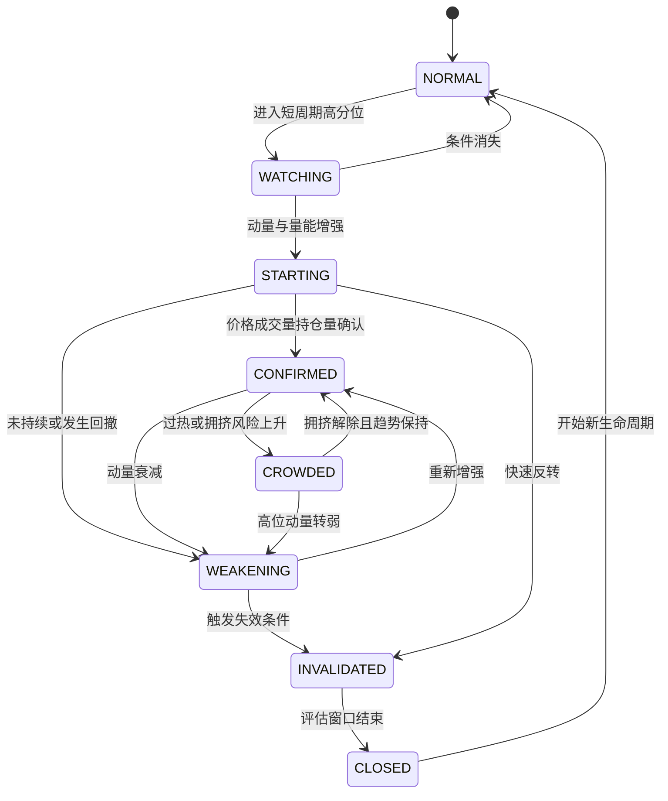
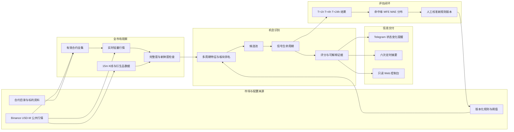

# Binance Market Radar V2：产品需求与业务架构

## 1. 产品定义

### 1.1 背景

V1 在北京时间 `00:00 / 04:00 / 08:00 / 12:00 / 16:00 / 20:00` 汇总 Binance
USDⓈ-M 永续合约的滚动 24 小时涨幅，并分别向 Telegram 推送 TradFi 和 Crypto
涨幅 Top 5。它能回答“现在谁涨得最多”，但不能回答：

- 这轮上涨是刚启动，还是已经接近拥挤阶段；
- 15 分钟和 1 小时的短周期动量是否正在增强；
- 上涨是否有成交量、持仓量和资金费率的支持；
- 历史上同类信号在 1 小时、4 小时、24 小时后表现如何；
- 系统是否遗漏数据、重复推送或使用了过期行情。

V2 将产品从“定时榜单通知器”升级为“全市场机会雷达”：持续观察全部目标合约，识别行情生命周期，只在状态发生有意义变化时通知，并对每个信号进行事后评估。

### 1.2 产品目标

1. 尽量在大幅上涨进入 24 小时 Top 5 之前发现启动迹象。
2. 区分趋势确认、短线挤仓、过热拥挤和动量衰减，降低单看涨幅追高的概率。
3. 为每个判断保留可解释证据，使用户能快速判断是否值得进一步研究。
4. 建立从采集、信号、通知到复盘的闭环，用真实结果淘汰无效规则。
5. 在 jmk 单机上稳定运行，并与现有 V1 和其他代理流量相互隔离。

### 1.3 非目标

V2 首期明确不做以下内容：

- 不接入 Binance 账户、余额、持仓或下单 API；
- 不自动交易，不给出确定性的买卖指令、仓位或杠杆建议；
- 不承诺预测价格，不把涨幅排名等同于可盈利机会；
- 不覆盖 Binance COIN-M、交割合约、期权或其他交易所；
- 不建设多人权限、计费、社交或复杂策略编排平台；
- 不在首期引入 Redis、Kafka、ClickHouse 等额外基础设施。

## 2. 用户与核心使用场景

首期主要用户是系统所有者本人，使用 Telegram 接收高优先级提醒，通过 Mac 在局域网或
Tailscale 中打开 jmk 上的只读 Web 控制台做进一步分析。

核心场景如下：

1. **发现启动**：某合约尚未进入 24 小时 Top 5，但 15 分钟或 1 小时收益进入板块前列，量能和持仓量开始配合，系统标记为“启动/确认”。
2. **判断质量**：用户打开详情页，查看价格、成交量、持仓量、资金费率、板块相对强度和触发理由。
3. **避免追高**：价格继续上涨但资金费率、持仓量或短周期动量显示拥挤/衰减，系统发出风险状态变化，而不是继续重复报喜。
4. **定时扫盘**：每天六个时点收到摘要，了解新启动、已确认、拥挤、失效的机会，并把 24 小时 Top 5 作为市场背景。
5. **复盘规则**：查看某类信号在 T+1h、T+4h、T+24h 的收益、最大有利波动 MFE 和最大不利波动 MAE，决定是否调整阈值。
6. **检查系统**：确认 WebSocket 是否新鲜、REST 是否限流、数据是否缺口、Telegram 是否发送成功。

## 3. 市场范围与数据口径

### 3.1 合约范围

系统每小时从 Binance `exchangeInfo` 刷新合约全集，只有同时符合以下条件的标的进入有效市场：

- `status == TRADING`；
- `quoteAsset` 位于配置白名单，V2 默认覆盖 `USDT,USDC`；
- `contractType == PERPETUAL` 时归为 Crypto；
- `contractType == TRADIFI_PERPETUAL` 时归为 TradFi。

停牌、结算中、交割、COIN-M 和期权产品不进入排行或信号。新上线和下线合约必须保留历史有效期，不能通过覆盖当前合约表破坏历史查询。

### 3.2 时间和收益口径

- 展示和调度默认使用 `Asia/Shanghai`；数据库时间统一存 UTC。
- 24 小时涨幅沿用 Binance 滚动 24 小时 ticker 口径。
- 15 分钟、1 小时收益按相应时间窗口起止价格计算，不用滚动 24 小时字段近似。
- 只使用已经完成的 K 线做历史统计；实时雷达可使用当前最新价与窗口起点价计算临时收益，并标注为实时值。
- 所有计算必须带 `event_time`、`received_at` 和数据新鲜度，禁止用过期缓存生成“当前”信号。

### 3.3 跌幅数据

系统继续采集完整涨跌数据，以便计算横截面分位数、风险和信号失效；但是：

- Telegram 定时报表不发送 TradFi 或 Crypto 跌幅 Top 5；
- 首期不生成独立的做空机会通知；
- 下跌可作为已有看涨信号减弱、失效或风险上升的证据。

## 4. 业务功能需求

### FR-01 全市场目录

- 自动发现所有有效 USDⓈ-M 永续合约并分为 TradFi、Crypto。
- 记录上线时间、下线时间、交易状态、基础资产、报价资产和 Binance 分类字段。
- 对目录新增、恢复、停牌和下线记录审计事件。

### FR-02 连续行情采集

- WebSocket 持续接收全市场轻量行情，维护每个标的最新价和滚动 24 小时信息。
- 每分钟形成内存价格点，支持实时 15 分钟和 1 小时收益；每 5 分钟持久化全市场快照。
- 每 15 分钟补齐全部有效合约的已完成 K 线，用于精确历史计算和重启恢复。
- 对候选标的按需拉取成交量细节、持仓量、持仓量历史、资金费率、标记价格和主动买卖比等衍生品数据。
- WebSocket 断开时自动重连并执行缺口检查；长时间无事件时由 watchdog 判定为失活，不能静默使用旧数据。

### FR-03 特征与板块比较

至少计算以下特征：

- `return_15m`、`return_1h`、`return_4h`、`return_24h`；
- 同一板块内的收益排名和分位数；
- 15 分钟成交量相对过去 20 个同周期的中位数倍数；
- 持仓量 15 分钟、1 小时变化；
- 当前资金费率、资金费率历史分位数；
- 价格方向与持仓量方向组合；
- 距短周期高点的回撤、动量加速度和连续性；
- 数据完整度、数据年龄和最低流动性过滤结果。

### FR-04 候选筛选

候选筛选采用“板块内相对排名 + 最低绝对门槛”，避免 Crypto 与 TradFi 共用一个不合理阈值。

冷启动默认条件满足任一项即可进入观察池：

- 15 分钟收益高于板块 P95，且 Crypto 至少 `+1.5%`、TradFi 至少 `+0.5%`；
- 1 小时收益高于板块 P90，且 Crypto 至少 `+3.0%`、TradFi 至少 `+1.0%`；
- 已有信号发生状态延续、减弱或失效，需要继续跟踪。

同时必须通过最低流动性和数据质量过滤。上述数值只是冷启动配置，必须在获得足够历史样本后按板块分别校准，不能作为固定投资规律。

### FR-05 信号生命周期

每个标的同一方向只能有一个活动生命周期。状态定义如下：

| 状态 | 含义 | 典型证据 | 是否可通知 |
| --- | --- | --- | --- |
| `NORMAL` | 无显著机会 | 未达到候选条件 | 否 |
| `WATCHING` | 异动进入观察池 | 短周期收益进入高分位 | 默认否 |
| `STARTING` | 可能启动 | 价格加速且量能开始放大 | 是 |
| `CONFIRMED` | 趋势获得确认 | 价格、成交量和持仓量共同支持 | 是 |
| `CROWDED` | 上涨但拥挤风险增加 | 资金费率极端、涨幅过快或 OI 结构恶化 | 是 |
| `WEAKENING` | 动量衰减 | 回撤扩大、短周期收益转弱或量价背离 | 是 |
| `INVALIDATED` | 原信号失效 | 跌破失效条件或数据证据反转 | 是 |
| `CLOSED` | 生命周期归档 | 超时、下线或失效后观察期结束 | 否 |

状态引擎必须记录每次转移的前状态、后状态、触发规则版本、证据快照和时间。阈值调整后，旧信号仍可按当时规则复现。

### FR-06 可解释评分

系统可用 0 到 100 的综合分帮助排序，但不能只保存最终分数。分数至少由以下独立子项组成：

- 动量与板块相对强度：30%；
- 成交量确认：20%；
- 持仓量结构：20%；
- 资金费率与拥挤惩罚：15%；
- 流动性与连续性：10%；
- 数据质量：5%。

这些权重同样是冷启动配置。详情和 Telegram 必须展示最关键的 2 至 4 条正面证据和风险证据，例如“1h 收益位于 Crypto P98”“价格上涨但 OI 下跌，可能以空头回补为主”。

### FR-07 Telegram 事件通知

事件通知只由有意义的状态转移触发：`STARTING`、`CONFIRMED`、`CROWDED`、
`WEAKENING`、`INVALIDATED`。消息包含：

- 标的、合约、板块和状态；
- 最新价、15m/1h/24h 收益和板块排名；
- 成交量、持仓量、资金费率的关键证据；
- 风险项、数据时间、信号 ID；
- 指向 Web 详情页的内网链接；
- “行情观察，不是自动下单指令”的简短产品口径。

同一合约、同一生命周期、同一状态只生成一个业务通知。可恢复发送必须有数据库幂等键和逐分片审计；
只有能够确认未送达的失败才能自动重试，传输结果不确定时进入人工核对状态。Telegram Bot API 不接收
本系统幂等键，因此不能虚假承诺网络任意故障下的 exactly-once。为避免频繁打扰，非风险升级状态默认有
60 分钟冷却期，风险状态可以绕过普通冷却期。

### FR-08 定时报表

继续在北京时间 `00 / 04 / 08 / 12 / 16 / 20` 点发送摘要，内容顺序为：

1. 最近 4 小时新进入 `STARTING` 的标的；
2. 当前 `CONFIRMED` 的高分机会；
3. 当前 `CROWDED`、`WEAKENING` 或刚 `INVALIDATED` 的风险变化；
4. TradFi 24 小时涨幅 Top 5；
5. Crypto 24 小时涨幅 Top 5；
6. 数据完整度和异常提示。

如果某个分组为空，明确显示“本时段无符合条件标的”。不发送跌幅 Top 5。每个报告时点只能成功发送一次，重启后仍需防重。

### FR-09 Web 控制台

首期为只读控制台，至少包含：

1. **机会雷达**：按板块、状态、评分、收益周期、流动性筛选当前机会；
2. **标的详情**：价格/K 线、成交量、OI、资金费率、特征、状态时间线和通知记录；
3. **信号历史**：按规则版本、状态、板块和日期检索；
4. **效果分析**：T+1h/T+4h/T+24h 收益、胜率、MFE、MAE 和样本数；
5. **系统健康**：采集延迟、断线、REST 错误、数据缺口、任务和 Telegram 状态。

控制台只监听 jmk 局域网/Tailscale 可达地址，不直接暴露公网。首期单用户可使用反向代理基础认证；任何写配置接口在有明确认证和审计之前不得上线。

### FR-10 信号评估与复盘

每次首次进入 `STARTING` 或 `CONFIRMED` 时建立评估基准，计算：

- T+1h、T+4h、T+24h 的价格收益；
- 各窗口内 MFE 和 MAE；
- 是否先触发最大不利波动再达到目标收益；
- 按板块、规则版本、市场状态和信号类型聚合的样本数与分布。

没有达到最小样本量时只展示原始分布，不给出“规则有效”的结论。默认至少积累 100 个独立生命周期后再讨论稳定胜率；该数字是统计分析门槛，不是盈利保证。

### FR-11 数据回补与质量

- 上线前从 Binance 可用的公开历史数据回补 K 线；无法回补的 OI、主动买卖比等字段从正式运行日起积累，并显示实际覆盖起点。
- 对每个采集窗口记录预计数量、实际数量、缺失数量和回补状态。
- 同一来源、合约、时间窗口的数据写入必须幂等。
- 数据不完整时降低质量分；关键数据过期时禁止产生 `CONFIRMED` 信号。

## 5. 业务架构

业务闭环不是“行情上涨 → 立即推送”，而是：全量观察 → 数据质量校验 → 候选筛选 →
证据确认 → 生命周期变化 → 分级交付 → 结果评估 → 人工发布新规则版本。这样可以把通知数量与信息价值绑定，并保证每次规则改动可追溯。

## 6. 通知决策矩阵

| 事件 | Telegram 即时提醒 | 定时摘要 | Web 展示 | 说明 |
| --- | --- | --- | --- | --- |
| 进入 `WATCHING` | 否 | 可统计数量 | 是 | 避免大量早期噪声 |
| 进入 `STARTING` | 是 | 是 | 是 | 首次机会提醒 |
| 进入 `CONFIRMED` | 是 | 是 | 是 | 展示确认依据 |
| 保持 `CONFIRMED` | 否 | 是 | 是 | 不重复轰炸 |
| 进入 `CROWDED` | 是 | 是 | 是 | 风险升级 |
| 进入 `WEAKENING` | 是 | 是 | 是 | 动量衰减 |
| 进入 `INVALIDATED` | 是 | 是 | 是 | 明确结束原判断 |
| 24h 涨幅 Top 5 | 否 | 是 | 是 | 作为市场背景，不视为新信号 |
| 24h 跌幅 Top 5 | 否 | 否 | 可查询 | 按当前产品决策不推送 |
| 数据源失活 | 仅严重故障 | 是 | 是 | 与投资信号分开标记 |

## 7. 非功能要求与验收指标

### 7.1 可靠性

- 正常网络下 WebSocket 行情接收延迟 P95 小于 10 秒。
- 全市场 5 分钟快照按日完整率不低于 99%；缺口必须可查询和回补。
- 六个定时报表在计划时间后 3 分钟内完成，失败在宽限期内重试。
- Telegram 同一幂等键的重复入队为 0；已确认成功的分片不重发，结果不确定的分片必须可查询且不自动重发。
- WebSocket 无事件、连接断开或 24 小时连接轮换必须可观测并自动恢复。

### 7.2 性能

- 机会雷达常用筛选查询 P95 小于 1 秒；标的详情最近 7 天查询 P95 小于 2 秒。
- 单机应能覆盖当前全部有效目标合约，并预留到 1,000 个合约的容量。
- 采集、信号计算与 Web 查询必须有独立并发限制，Web 查询不能拖垮采集。

### 7.3 安全与运维

- Binance 使用公共只读接口，不配置交易 API Key。
- Telegram Token 和数据库密码只通过 jmk 本地 `.env` 或 secret 文件注入，不写日志、不入 Git。
- 数据库不开放公网；Web 控制台仅局域网/Tailscale 可访问。
- 服务级代理只设置为 `http://127.0.0.1:7890`，不得修改宿主机全局代理或 `7891` 节点。
- 每日数据库备份，至少每季度执行一次恢复演练；没有恢复验证的备份不视为有效备份。

### 7.4 可解释与可复现

- 100% 信号事件带规则版本、证据快照和行情时间。
- 任一历史信号可以还原当时特征、状态转移原因和通知结果。
- 阈值、权重和过滤条件必须由配置版本管理，禁止只改代码却无法区分历史结果。

## 8. V2 验收边界

V2 首次可用版本需要同时满足：

1. 全市场目录、实时行情、15 分钟 K 线和候选衍生数据稳定落库；
2. 能正确计算 15m、1h、24h 收益和板块分位数；
3. 生命周期状态可重启恢复，同一事件不会重复；
4. 即时通知和六次摘要均可 dry-run、测试发送并审计；
5. Web 控制台能查询当前机会、标的详情、信号历史和系统健康；
6. T+1h/T+4h/T+24h 评估任务正常运行；
7. V1 仍可独立运行，V2 故障不会中断 V1；
8. 完成至少 7 天影子运行，数据完整率和重复通知指标达标后，才启用正式事件通知。

## 9. 关键产品风险

1. **短周期上涨不等于可交易机会**：V2 的价值在于更早、更完整地呈现证据，不在于制造确定性。
2. **冷启动样本不足**：初始阈值只能用于收集样本，应先影子运行，再依据结果校准。
3. **衍生品指标存在歧义**：价格上涨、OI 上涨通常表示新增仓位，但不能单独证明方向；必须联合成交量、资金费率和后续价格验证。
4. **TradFi 与 Crypto 微观结构不同**：阈值、流动性和交易时段应分板块配置，不能强行共用一套参数。
5. **通知过多会使产品失效**：必须坚持状态变化触发、冷却、去重和每日通知统计。
6. **数据缺口会伪造信号**：数据质量不是附属监控，而是信号是否允许确认的前置条件。
