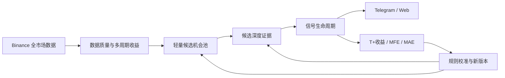

# Binance Market Radar：总体产品与开发 Roadmap

> 本文档是项目唯一的总体 Roadmap，负责定义产品终点、开发主线、阶段顺序和范围边界。
> `v2-execution-plan.md`、`v2-multi-horizon-top5-plan.md`、`v2-watchdog-plan.md` 和
> `v2-signal-lifecycle-plan.md` 是从属于本文档的专项执行台账。专项台账与本文冲突时，先更新
> 本文并说明变更原因，不能直接绕过总体路线开发。

## 1. 文档状态

| 项目 | 内容 |
| --- | --- |
| 状态 | ACTIVE |
| 产品 | Binance Market Radar |
| 当前版本 | V1 生产通知 + V2 影子市场雷达 |
| 开发分支 | `feature/v2-market-radar` |
| 最后更新 | 2026-08-30 |
| 当前主阶段 | R3 已完成 24 小时取证，正在修复 LOW_ACTIVITY 告警口径；R4-A0 已完成 |
| 下一开发阶段 | R3 修正版验收后进入 R4-A1 候选领域模型与持久化 |

## 2. 产品北极星

本项目的最终产品是：

> 面向人工投资决策的 Binance USDⓈ-M 市场机会雷达。系统持续发现机会、解释机会、跟踪机会，
> 并使用后续真实收益验证判断是否有效。

系统最终必须回答六个问题：

1. 哪些标的正在启动，而不只是已经涨得最多？
2. 上涨有没有成交量和持仓量确认？
3. 当前是否已经过热或拥挤？
4. 信号正在增强、延续、衰减还是失效？
5. 同类历史信号之后的收益、MFE 和 MAE 如何？
6. 当前判断所依赖的数据是否完整、及时、可信？

如果不能回答这些问题，系统仍然只是一个复杂的涨幅榜。

## 3. 产品边界

### 3.1 主线范围

- Binance USDⓈ-M 永续合约；
- Crypto 与 TradFi 分板块分析；
- 当前主方向为上涨机会和 long-side 生命周期；
- `15m`、`1h`、`4h`、`24h` 多周期收益；
- 成交量、Open Interest、Funding、Mark/Premium 和必要时的 Taker 数据；
- 候选、证据、生命周期、结果评估；
- Telegram 提醒与只读 Web 研究界面；
- PostgreSQL 事实库、历史重放和审计。

### 3.2 当前明确不做

- 自动下单、账户 API、仓位管理和自动止盈止损；
- 机器学习或 LLM 直接生成买卖指令；
- 新闻、社交媒体情绪和全市场高频订单簿；
- 在没有明确瓶颈前引入 Redis、Kafka 或微服务拆分；
- 在信号有效性尚未评估前建设复杂 Web 前端；
- 把传统交易所休市日历直接套到 Binance TradFi 永续；
- 未明确资产身份和可靠数据源前，把 MARS 等外部资产混入 Binance 主数据口径；
- 为追求功能数量而增加未经验证的指标和通知。

外部资产以后只能通过独立 adapter、独立数据质量规则和独立 universe 接入，不得污染
Binance USDⓈ-M 的事实口径。

## 4. 产品闭环



开发顺序固定为：

> 数据可信 → 候选发现 → 证据确认 → 生命周期跟踪 → 结果评估 → 克制通知 → 页面研究。

Telegram 排版、Web 页面和更多指标都不能越过上游数据与评估门禁。

## 5. 当前真实状态

截至 2026-08-28：

- V1 继续承担生产 Telegram 定时通知；
- V2 worker/API/watchdog 在 jmk 上运行，PostgreSQL 正式 schema 为 7；
- V2 已完成全市场采集、历史回补、多周期收益、分板块 Top 5、只读 API、outbox 和 watchdog；
- MHR-9-1 代码已在提交 `7a45160` 完成，包含 Binance 合约状态和 raw/session-adjusted 双覆盖率；
- MHR-9-1 已部署到 jmk并完成超过 24 小时取证；实际数据证明分类与全源断流检测正确，
  但周末 TradFi `LOW_ACTIVITY` 会导致 adjusted coverage 产生告警风暴，当前正在增加独立的
  operational coverage，修复后才关闭 R3；
- 不改线上服务的 R4-A0 已完成七天候选指标分布分析；原始候选五分钟换手较高，R4-A1
  必须实现容量、滞回和逐原因审计；
- V2 reporter 仍然禁用，尚未向正式群发送 V2 投资信号；
- 当前系统可以可靠回答“谁涨得最多”，还不能可靠回答“是否刚启动、是否值得进入”。

## 6. 统一阶段 Roadmap

状态只允许：`COMPLETED`、`CODE_COMPLETE`、`IN_PROGRESS`、`PENDING`、`BLOCKED`。

| ID | 阶段 | 状态 | 核心结果 |
| --- | --- | --- | --- |
| R0 | V1 基础通知 | COMPLETED | 生产 Telegram 定时报表稳定运行 |
| R1 | V2 市场数据底座 | COMPLETED | 全市场数据可持续采集、回补、审计和告警 |
| R2 | V2 多周期市场雷达 | COMPLETED | 15m/1h/4h/24h 分板块榜单可重放 |
| R3 | 市场状态与质量语义 | IN_PROGRESS | 24 小时取证完成，LOW_ACTIVITY 告警口径修正与部署验收中 |
| R4 | 候选机会池与分层采集 | PENDING | 从全市场筛选启动候选，只对候选采集深度数据 |
| R5 | 可解释信号与生命周期 | PENDING | 证据、评分和状态转移可审计、可重放 |
| R6 | 信号结果评估与校准 | PENDING | T+收益、MFE、MAE 驱动规则版本迭代 |
| R7 | Telegram V2 信号通知 | PENDING | 测试群先行，状态变化通知无业务重复 |
| R8 | 只读 Web 控制台 | PENDING | 机会、标的、生命周期、效果和健康可研究 |
| R9 | 生产硬化与渐进切换 | PENDING | 备份恢复、故障演练、7 天验收和 V1 回退完成 |

### R0：V1 基础通知

目标：保留当前可用通知能力，避免 V2 开发影响生产。

策略：只维护故障和兼容性，不再向 V1 增加投资判断逻辑。V1 只能在 R9 完成后单独决定是否停止。

### R1：V2 市场数据底座

已交付：

- Binance 合约目录和有效期；
- 全市场 WebSocket miniTicker；
- 5 分钟快照和 15 分钟 K 线；
- 历史回补、缺口恢复、幂等写入；
- PostgreSQL、worker heartbeat 和 watchdog；
- 7890 出网边界，7891 不受影响。

该阶段解决“数据能不能信”。

### R2：V2 多周期市场雷达

已交付：

- `15m/1h/4h/24h` 收益率；
- Crypto/TradFi 分板块稳定排名；
- Top N、历史时点重放和质量原因码；
- 只读 API、报告生成和可靠 outbox；
- 只推涨幅榜，不推跌幅榜。

该阶段只解决“谁涨得最多”，不把排名包装成买入信号。

### R3：市场状态与质量语义

对应 MHR-9-1。部署步骤已于 2026-08-28 执行：

1. 已备份并校验 jmk PostgreSQL；
2. 已部署包含提交 `7a45160` 的静态 Linux AMD64 构建；
3. 已执行 migration 6 → 7，重复执行为 `applied=0`；
4. 已重启并验证 worker/API，watchdog 在 worker 恢复健康后重新启动；
5. 已验证历史质量查询、多周期收益和榜单兼容；
6. 已连续观察超过 24 小时 raw/session-adjusted coverage；
7. 已由一次真实 WebSocket 新鲜度故障证明 `SOURCE_UNAVAILABLE` 分类、自动重连和 watchdog
   incident/recovery 状态机有效；
8. 正在增加 operational coverage，避免正常 `LOW_ACTIVITY` 触发系统故障，同时保留严格审计。

完成标准：R3 完成 24 小时连续验收并变为 `COMPLETED` 后，才能开始长期运行 R4 候选任务。

### R4：候选机会池与分层采集

R4 必须拆分，不能一次对全部 700 多个合约高频抓取所有深度端点。

#### R4-A：轻量候选池

R4-A0 只读分布分析已完成，结果见
[R4-A0 候选指标分布分析](./v2-candidate-distribution-analysis.md)。该准备工作不代表 R4 已启动
线上任务；R3 仍须先完成连续观察验收。

仅使用现有数据：

- 15m/1h 板块分位数和绝对收益门槛；
- 动量加速度与连续性；
- 最近成交额和最低流动性；
- 合约状态与数据质量；
- 已有活动候选的延续优先级；
- Crypto/TradFi 独立数量上限。

交付物：候选规则版本、进入/延续/退出结果、幂等审计、API 和 24–48 小时影子统计。

#### R4-B：候选深度数据

只对候选和已有活动生命周期采集，优先顺序固定为：

1. Open Interest；
2. Funding Rate；
3. Mark Price/Premium；
4. Taker Buy/Sell Ratio，仅在前三项不足以判断时引入。

每个端点必须有权重预算、新鲜度、有限重试、缺口审计和降级语义。未知值不能用零填充。

### R5：可解释信号与生命周期

建议首版状态：

```text
NORMAL
  -> WATCHING
  -> STARTING
  -> CONFIRMED
  -> CROWDED / WEAKENING
  -> INVALIDATED
  -> CLOSED
```

每次状态变化必须保存 event time、规则版本、前后状态、特征引用、正面证据、风险证据和质量状态。

首版 `CONFIRMED` 至少要求：

- 数据质量通过；
- 动量门槛通过；
- 成交量或 OI 至少一项确认；
- funding 未达到明显拥挤阈值。

综合分可以存在，但不得只输出黑盒总分。关键证据未知时限制最高可达状态。

### R6：结果评估与规则校准

每个生命周期自动计算：

- T+15m、T+1h、T+4h、T+24h 收益；
- 最大有利波动 MFE；
- 最大不利波动 MAE；
- 从 `STARTING` 到 `CONFIRMED` 的机会损耗；
- `CROWDED/WEAKENING` 后的回撤；
- 按板块、规则版本、状态和质量分组的结果。

规则只能发布新版本，不能修改旧事件。至少积累约 100 个完整生命周期结果后再做第一次正式校准；
样本不足时只展示事实，不宣称策略有效。

R6 的优先级高于正式 Telegram 信号和复杂 Web，因为没有结果评估就无法判断规则是在改善还是恶化。

### R7：Telegram V2 信号通知

通知分为两类：

- 定时报表：多周期 Top 5、市场状态和质量摘要；
- 事件通知：`STARTING`、`CONFIRMED`、`CROWDED`、`WEAKENING`、`INVALIDATED`。

`WATCHING` 默认不通知。必须具有冷却、每日上限、生命周期幂等、测试/正式 Chat ID 隔离。
先运行 dry-run 和测试群，正式群默认关闭。

### R8：只读 Web 控制台

首版只做四个页面：

1. 市场雷达：候选和活动信号；
2. 标的详情：收益、OI、funding、证据和事件时间线；
3. 信号历史：状态变化和当时证据；
4. 效果评估：T+收益、MFE、MAE 和分组统计。

PostgreSQL 当前足够。只有实际查询压力证明需要缓存时才评估 Redis。

### R9：生产硬化与渐进切换

- PostgreSQL 每日备份和临时库恢复演练；
- WebSocket、代理、429、Telegram、数据库故障演练；
- jmk 资源限制、日志轮转和磁盘监控；
- 连续 7 天影子运行；
- 测试群、小范围正式群、完全启用三阶段切换；
- 单独评审 V1 是否停止，并保留旧二进制和数据作为回退。

## 7. 近期严格执行顺序

| 顺序 | 工作 | 开发估时 | 必要观察 |
| --- | --- | ---: | ---: |
| 1 | 部署并验收 R3/MHR-9-1 | 0.5–1 天 | 24 小时 |
| 2 | R4-A 轻量候选池 | 1–2 天 | 24–48 小时 |
| 3 | R4-B 的 OI + Funding 采集 | 1.5–2 天 | 24–48 小时 |
| 4 | 评估是否需要 Mark/Taker | 0.5 天 | 依据前三项数据决定 |
| 5 | R5 深度特征、证据和评分 | 1–2 天 | — |
| 6 | R5 生命周期状态机 | 1.5–2 天 | 48 小时 |
| 7 | R6 T+结果、MFE、MAE | 1–2 天 | 2–4 周积累 |
| 8 | R7 测试群 Telegram 信号 | 0.5–1 天 | 48 小时 |
| 9 | R8 Web 控制台 | 3–5 天 | — |
| 10 | R9 生产硬化与渐进切换 | 1–2 天 | 7 天 |

估时不是完成证据。观察期未达到验收门槛时，不能因日期到了而进入下一阶段。

## 8. 阶段门禁

每个阶段完成必须同时满足：

- 领域规则和数据口径有版本；
- 新核心逻辑有单元测试，PostgreSQL 行为有隔离集成测试；
- `go test ./...`、`go vet ./...` 和目标核心包 race 通过；
- 输入、输出、错误和降级路径可审计；
- 文档与代码、migration、环境变量和部署状态同步；
- V1 行为、7891 和既有 PostgreSQL 历史不受影响；
- jmk 部署必须单独记录，代码完成不等于线上完成；
- 没有验收证据不得标记 `COMPLETED`。

## 9. 成功指标

### 9.1 系统指标

- 关键流水线无静默缺口；
- adjusted coverage 稳定达到配置门槛；
- 数据源异常能及时告警并在恢复后回到健康状态；
- worker/API 重启可恢复，写入和重放保持幂等；
- PostgreSQL 备份可实际恢复；
- Telegram 业务重复为 0。

### 9.2 产品指标

- 每个候选有结构化进入原因；
- 每个状态变化可以从数据库还原当时证据；
- 每个到期生命周期都有 T+收益、MFE 和 MAE；
- 系统能区分“没有机会”和“数据坏了”；
- 规则调整有样本、结果和新版本，而不是凭感觉覆盖旧参数。

## 10. 路线变更规则

任何新增需求在开发前必须回答：

1. 它属于 R0–R9 的哪个阶段？
2. 它解决北极星六个问题中的哪一个？
3. 上游数据和前置阶段是否已经完成？
4. 是否会改变数据库事实口径、代理边界或 V1 行为？
5. 验收指标和退出条件是什么？

无法映射到 Roadmap、没有验收标准或会绕过当前阶段门禁的需求，默认进入 backlog，不立即开发。

## 11. 当前执行点

当前不应直接开发 Web、自动交易、MARS、新闻情绪或更多通知模板。

当前执行顺序是：

1. 从 2026-08-28 11:40（北京时间）的首个完整新规则窗口开始观察 24 小时；
2. 复核 adjusted coverage、状态分布、流水线失败、watchdog 和资源使用；
3. 将 R3 验收结果写入台账；
4. R4-A0 七天只读分布分析已经完成，不改变线上门禁；
5. R3 验收通过后启动 R4-A1 候选领域模型、持久化和影子任务。
