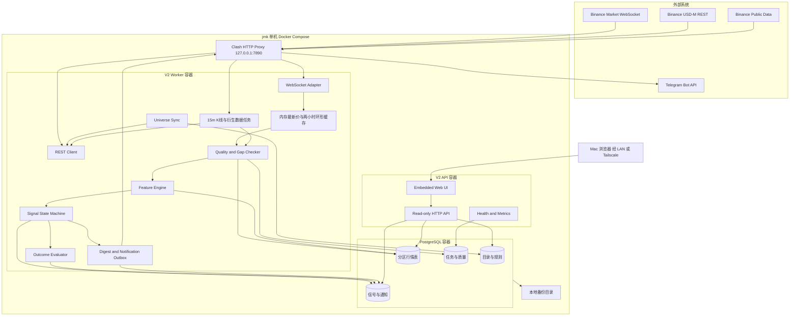
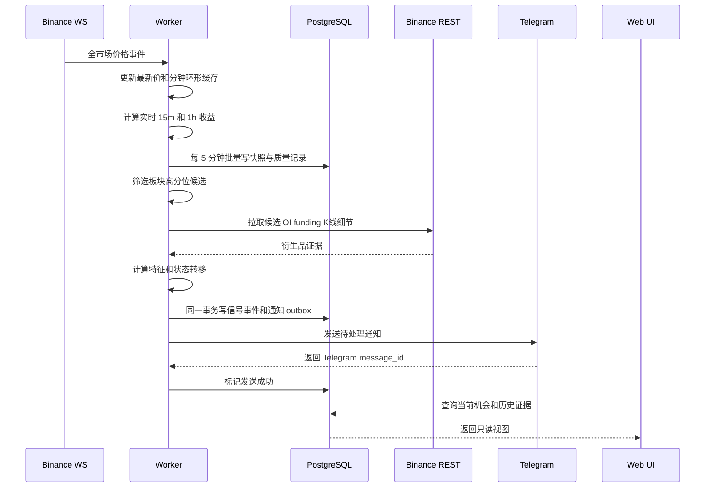
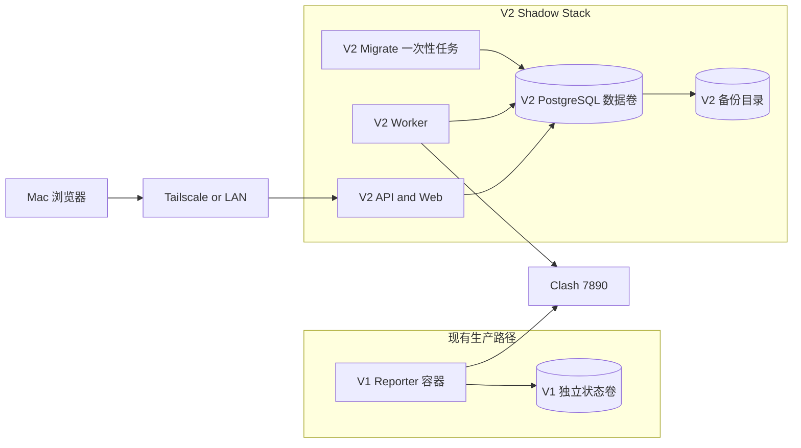

# Binance Market Radar V2：技术架构与数据设计

## 1. 架构原则

1. **模块化单体优先**：一个 Go 仓库、一个版本，按运行角色拆成 `worker`、`api`、`migrate`、`backfill`，避免单机项目过早微服务化。
2. **采集与查询隔离**：jmk 上用不同容器运行 worker 和 API；二者共享 PostgreSQL，但有独立连接池和资源限制。
3. **PostgreSQL 是唯一事实来源**：首期不引入 Redis 或消息队列。内存缓存可以丢失，持久状态必须可从 PostgreSQL 恢复。
4. **官方 WS、自有 REST**：Binance REST 继续使用项目现有轻量客户端；WebSocket 使用 Binance 官方 Go SDK并封装适配层，业务代码不直接依赖 SDK 类型。
5. **数据质量先于信号**：事件时间、接收时间、新鲜度、缺口与规则版本是一等数据。
6. **V1/V2 并行迁移**：不原地替换当前 jmk V1。V2 使用独立容器、端口、数据库和数据卷，影子运行通过后再决定是否停 V1。

## 2. 总体技术架构图



图中的箭头表达逻辑数据流。由于 Clash 在宿主机上监听，容器访问宿主机代理时需要使用
实际可达的 host gateway 地址；配置值仍统一为 `HTTP_PROXY_URL`，不能在代码中写死
`127.0.0.1`。部署时应验证容器内代理地址确实指向 jmk 宿主机的 7890。

## 3. 运行角色与代码边界

建议将入口统一为一个二进制：

```text
binance-monitor worker     # 目录、采集、特征、信号、评估、通知
binance-monitor api        # 只读 API、Web UI、健康检查
binance-monitor migrate    # 数据库迁移，只执行后退出
binance-monitor backfill   # 可恢复的历史 K 线回补
binance-monitor v1 ...     # 迁移期保留现有 V1 行为，或继续使用旧镜像
```

建议的 Go 包边界：

```text
cmd/binance-monitor/
internal/
├── binance/          # 现有 REST 客户端，扩展 klines/OI/funding/taker
├── binancews/        # 官方 SDK 适配层、重连、watchdog、事件归一化
├── universe/         # 合约有效期与板块分类
├── collector/        # 采集编排、限速、缺口检测、回补
├── marketdata/       # 统一行情模型、聚合与窗口缓存
├── feature/          # 收益、分位数、量能、OI、funding 特征
├── signal/           # 版本化规则、评分、生命周期状态机
├── evaluation/       # T+1h/T+4h/T+24h、MFE、MAE
├── notification/     # outbox、冷却、去重、Telegram 渲染与发送
├── digest/           # 六次定时摘要
├── storage/postgres/ # pgx 仓储、事务、迁移
├── api/              # 只读 JSON API
├── web/              # 嵌入式静态前端
├── health/           # readiness、liveness、内部指标
└── config/           # 环境配置与验证
```

接口边界示例：

- `MarketStream` 只输出归一化事件，不泄漏官方 SDK 类型；
- `MarketRepository` 负责幂等批量写入和时间范围查询；
- `RuleEngine` 输入特征与当前状态，输出状态转移建议和证据；
- `SignalRepository` 用事务和行锁保证单生命周期一致性；
- `OutboxRepository` 同一事务写信号事件与待发消息，防止状态已变但消息丢失。

## 4. 数据采集架构

### 4.1 两层采集

| 层级 | 覆盖范围 | 数据 | 频率 | 用途 |
| --- | --- | --- | --- | --- |
| 全市场轻量层 | 全部有效合约 | WS 最新价、滚动 24h、内存分钟点 | 实时 | 15m/1h 临时收益、候选发现、24h 背景 |
| 全市场历史层 | 全部有效合约 | 已完成 15m K 线 | 每 15 分钟 | 精确历史、重启恢复、回测与图表 |
| 候选深度层 | 观察池、活动信号、自选 | OI、OI 历史、funding、mark price、taker/K线细节 | 通常 5 分钟，按端点限速 | 确认、拥挤和失效判断 |
| 目录层 | 全部合约 | exchangeInfo | 每小时及启动时 | 新增/下线、分类、精度 |

全市场轻量层不能替代已完成 K 线。它用于尽快发现异动；最终历史统计以已完成 K 线为准。

### 4.2 WebSocket 生命周期

- 使用 Binance 官方 Go SDK 的 market connection；不创建私有账户连接。
- 订阅和 SDK 细节封装在 `internal/binancews`。
- 保存 `last_event_at`、`last_exchange_event_time` 和重连次数。
- watchdog 在超过配置窗口没有有效事件时主动判死并重连。
- 在 Binance 连接生命周期上限前做带抖动的主动轮换，避免所有实例同一时刻重连。
- 重连后用 REST/数据库检查最后完整窗口并补缺；不能假定重连期间没有行情。
- 按 `symbol + event_time + event_type` 去重；迟到事件按事件时间归档。
- 分钟点在 UTC 自然分钟边界采样；允许最多 2 秒边界调度偏差，超过配置新鲜度的行情丢弃。
- 5 分钟快照的 `bucket_time` 是闭合窗口起点，窗口采用 `[start,end)`；例如 `12:05`
  执行时写入 `bucket_time=12:00`。
- miniTicker 是滚动状态而非可重放事件流，停机窗口只能登记为缺口；后续由已完成 15 分钟 K 线
  恢复精确历史，禁止拿重连后的最新价伪造历史快照。

### 4.3 REST 限速与降级

- 每个端点配置权重和并发上限，读取 Binance 返回的限流头并记录使用量。
- HTTP 429 按 `Retry-After` 退避；5xx 和网络错误指数退避并加随机抖动。
- 深度数据任务失败时，保留价格观察但降低数据质量，禁止升级到 `CONFIRMED`。
- 24h ticker、目录和 K 线任务各自有断路状态，不能因一个端点失败阻塞整个 worker。
- 代理只在本服务 HTTP transport 和 WS dialer 中显式配置；不要修改 Docker daemon 或宿主机全局代理。

## 5. 核心数据流



关键一致性点是“信号事件 + outbox”同事务提交。Telegram 是外部系统，不可能和数据库做分布式事务，因此发送器至少一次处理 outbox，再依靠业务幂等键阻止重复业务消息。

## 6. PostgreSQL 数据模型

建议使用 PostgreSQL 月度范围分区，不依赖扩展。首期核心表如下：

| 表 | 关键字段 | 用途与约束 |
| --- | --- | --- |
| `instruments` | `id, symbol, sector, contract_type, valid_from, valid_to, status` | 合约有效期，不覆盖历史 |
| `market_snapshots_5m` | `instrument_id, bucket_time, last_price, change_24h, volume_24h, quality` | 全市场快照；按月分区；唯一键为合约和窗口 |
| `klines_15m` | `instrument_id, open_time, OHLCV, close_time, source` | 已完成 K 线；按月分区；幂等 upsert |
| `derivative_snapshots` | `instrument_id, observed_at, open_interest, funding_rate, mark_price, taker_ratio` | 候选深度证据；按月分区 |
| `feature_snapshots` | `instrument_id, calculated_at, feature_version, values_json, quality` | 可复现特征；热点列可独立存储 |
| `rule_versions` | `id, version, sector, config_json, active_from, created_at` | 不可变规则配置 |
| `signal_lifecycles` | `id, instrument_id, direction, current_state, started_at, closed_at, rule_version_id` | 每个活动生命周期唯一 |
| `signal_events` | `id, lifecycle_id, from_state, to_state, occurred_at, score, evidence_json` | 不可变状态转移日志 |
| `signal_evaluations` | `signal_event_id, horizon, return, mfe, mae, evaluated_at` | 结果评估；事件和周期唯一 |
| `notification_outbox` | `id, idempotency_key, payload, status, attempts, next_attempt_at` | 可靠发送队列 |
| `notification_deliveries` | `outbox_id, chat_id, telegram_message_id, sent_at, error` | 多 Chat ID 发送审计 |
| `collection_runs` | `job_type, window, expected, actual, missing, status, error` | 数据质量与任务审计 |
| `system_heartbeats` | `component, observed_at, status, detail_json` | 健康页数据 |

### 6.1 保留策略

- 全市场 5 分钟快照：180 天；
- 15 分钟 K 线：至少 2 年；
- 原始候选衍生数据：180 天，之后可保留小时聚合；
- 信号、规则、评估、通知和任务审计：长期保留；
- 日志：默认 30 天，错误摘要长期聚合。

以 500 个有效合约估算，180 天的 5 分钟快照约 2,592 万行；两年的 15 分钟 K 线约
3,504 万行。实际磁盘占用受字段、索引、压缩和有效合约数量影响，不能用理论行数直接承诺容量。上线一周后必须依据真实表大小修订磁盘预算和索引。

### 6.2 索引原则

- 分区表主查询索引以 `(instrument_id, time DESC)` 为主。
- 当前机会使用小表 `signal_lifecycles` 的部分索引，不扫行情大表。
- JSON 只保存低频变化或证据快照；高频过滤字段使用类型化列。
- 批量写入用 `COPY` 或 pgx batch；不要为每个 ticker 单独开启事务。
- 删除历史通过 detach/drop 到期分区完成，避免大表逐行 delete。

## 7. API 与 Web

首期只读 API 建议：

```text
GET /api/v1/radar?sector=&state=&min_score=
GET /api/v1/instruments/{symbol}
GET /api/v1/instruments/{symbol}/series?from=&to=&interval=
GET /api/v1/instruments/{symbol}/signals
GET /api/v1/signals/{id}
GET /api/v1/performance?rule_version=&sector=&from=&to=
GET /api/v1/health
GET /health/live
GET /health/ready
```

Web 静态资源使用 `go:embed` 打入 API 二进制，减少 jmk 部署组件。图表可使用前端轻量库，但必须固定版本并在构建时打包，运行时不依赖公共 CDN。API 对大时间范围强制限制、分页和超时。

## 8. 配置与密钥

配置按职责分组，关键环境变量建议如下：

```dotenv
APP_ROLE=worker
APP_TIMEZONE=Asia/Shanghai
DATABASE_URL=postgres://...
QUOTE_ASSETS=USDT,USDC
BINANCE_FAPI_BASE_URL=https://fapi.binance.com
BINANCE_WS_BASE_URL=wss://fstream.binance.com
HTTP_PROXY_URL=http://host.docker.internal:7890
TELEGRAM_BOT_TOKEN=...
TELEGRAM_CHAT_IDS=-100...
REPORT_HOURS=0,4,8,12,16,20
WEB_LISTEN_ADDR=0.0.0.0:8080
```

Linux Docker 的 `host.docker.internal` 需要在 Compose 中映射 `host-gateway`，并验证 Clash
是否允许来自 Docker bridge 的访问。如果 Clash 只监听宿主机 loopback，应使用宿主网络或调整为仅 Docker bridge
可达的安全监听地址。`7891` 不属于本项目配置，任何 V2 配置和文档都不得把它当作自动故障转移节点。

密钥要求：

- `.env` 权限限制为部署用户可读；
- 日志对 URL、Token、数据库 DSN 做脱敏；
- Web 健康接口不得回显密钥；
- 配置启动时验证，缺失关键密钥立即失败，不以空值运行。

## 9. jmk 部署拓扑与迁移



迁移顺序：

1. 保持 V1 原镜像、`.env`、状态卷和 Telegram 行为不变。
2. V2 使用独立 Compose project name、容器名、端口、`.env` 和数据卷。
3. 先启动 PostgreSQL 和 migrate，再启动 V2 worker 的 shadow 模式；shadow 模式生成信号但不发送事件通知。
4. 验证代理、WS 重连、数据完整率、数据库增长和回补。
5. 启动仅内网可达的 API/Web。
6. 至少 7 天后先启用测试 Chat ID，再启用正式事件通知。
7. V1 定时报表是否停用是单独的产品切换决定；未明确切换前继续运行，避免监控空窗。

## 10. 可观测性与故障处理

### 10.1 必须记录的指标

- WS 连接状态、最近事件时间、事件延迟、重连次数；
- REST 每端点请求量、耗时、429/5xx、重试和限流余量；
- 每窗口预期/实际合约数、缺口数、回补数；
- 候选数量、各生命周期状态数量、规则触发数；
- outbox 待发数、失败数、最老消息年龄、重复幂等拦截数；
- PostgreSQL 连接池、慢查询、表和分区大小；
- worker/API 进程存活、内存、goroutine 和任务耗时。

### 10.2 健康语义

- `live`：进程事件循环仍工作；
- `ready`：数据库可用、目录已加载、行情在新鲜度窗口内；
- `degraded`：价格可用但深度数据缺失，只允许观察/风险状态，不允许确认；
- `unhealthy`：行情过期、数据库不可写或关键任务连续失败，停止生成新投资信号并发送系统告警。

### 10.3 备份

- 每日 `pg_dump` 或受控物理备份写入独立目录，保留最近 7 个日备份和 4 个周备份；
- 备份任务记录校验和、开始/结束时间、大小和错误；
- 恢复演练使用临时数据库验证 schema、关键行数和最近信号，不覆盖生产库。

## 11. 测试策略

1. **单元测试**：收益、分位数、评分、状态转移、冷却、幂等键和报告渲染。
2. **属性测试**：乱序/重复/缺失事件下聚合结果不违反时间和唯一性约束。
3. **契约测试**：保存 Binance REST/WS 样本，验证字段变化和 TradFi 分类。
4. **PostgreSQL 集成测试**：迁移、批量 upsert、分区、事务 outbox、并发状态转移。
5. **故障测试**：断 WS、429、代理不可用、Telegram 超时、数据库重启和磁盘告警。
6. **影子测试**：实际 jmk 行情至少运行 7 天，不发正式事件通知，比较实时值与完成 K 线。
7. **部署回归**：确认 V1 仍按时发送，V2 只走 7890，7891 和其他服务无变化。

## 12. 技术选型结论

| 领域 | 选择 | 原因 |
| --- | --- | --- |
| 语言 | Go | 延续现有代码，适合常驻并发采集和单二进制部署 |
| CLI | Cobra | 成熟命令树、帮助、参数校验和后续多级运维命令扩展 |
| REST | 现有自有客户端 | 类型精简、已有重试测试，按需扩展端点 |
| WebSocket | Binance 官方 Go SDK + 自有适配层 | 复用连接、ping/pong、重连能力，同时隔离 SDK 变更 |
| 数据库 | PostgreSQL + pgx/v5 | 事务 outbox、时间范围查询、分区和 JSON 证据均适合 |
| 缓存/队列 | 首期不引入 | 当前单机吞吐不需要 Redis/Kafka，减少故障面 |
| Web | Go API + 嵌入式前端 | 部署简单、无运行时 CDN 依赖 |
| 部署 | Docker Compose on jmk | 与现有环境一致，容器和数据卷可隔离 |
| 出网 | Clash 7890，服务级显式代理 | 保持当前 Binance/Telegram 可用路径，不影响 7891 |

未选用通用交易框架，是因为本项目不下单且需要可控的数据模型；引入大型交易机器人框架会增加许可证、数据库和运行复杂度。官方 SDK 也不直接贯穿业务层，以免生成类型或接口变化扩大改动面。
